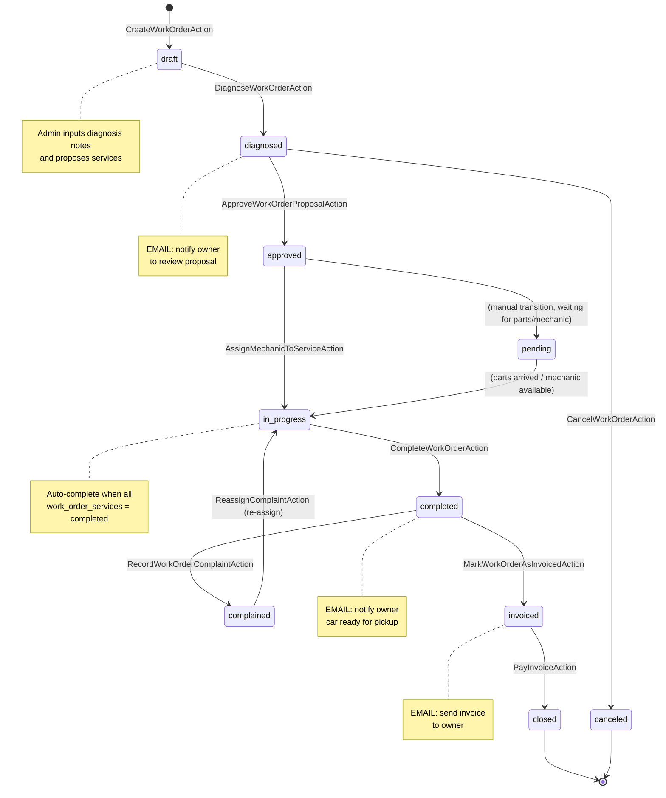
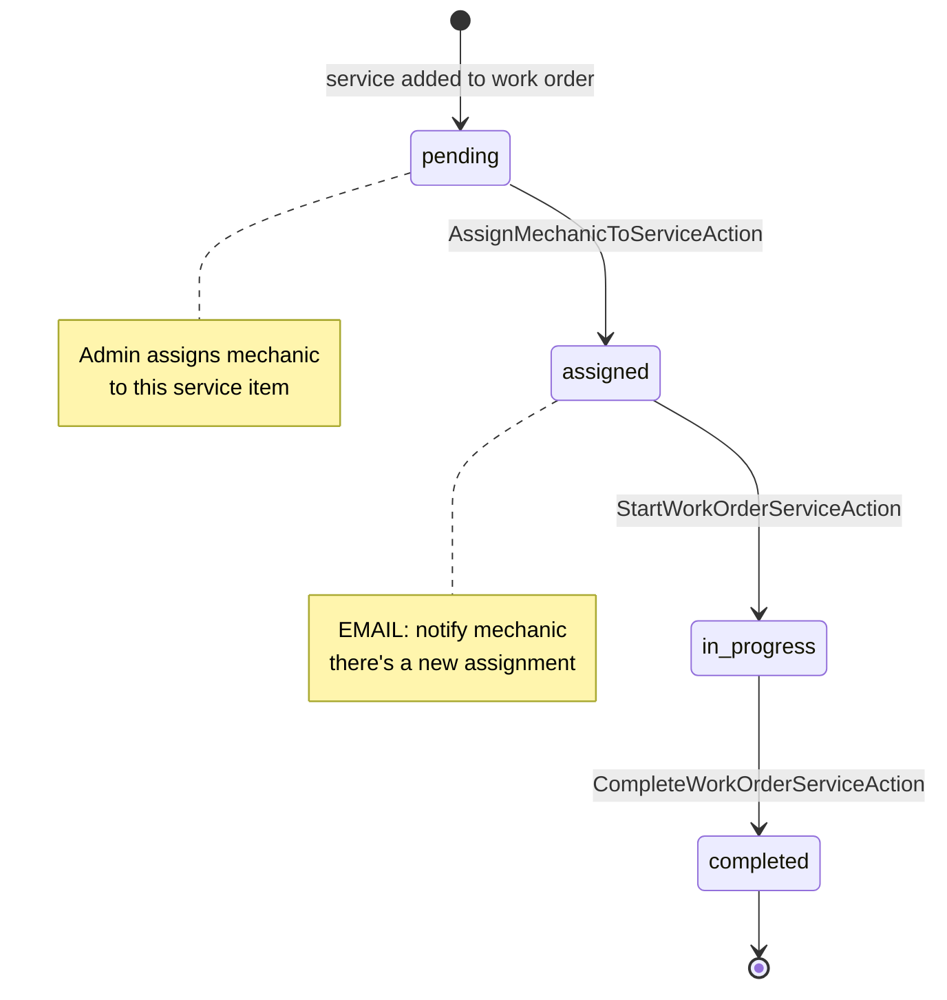
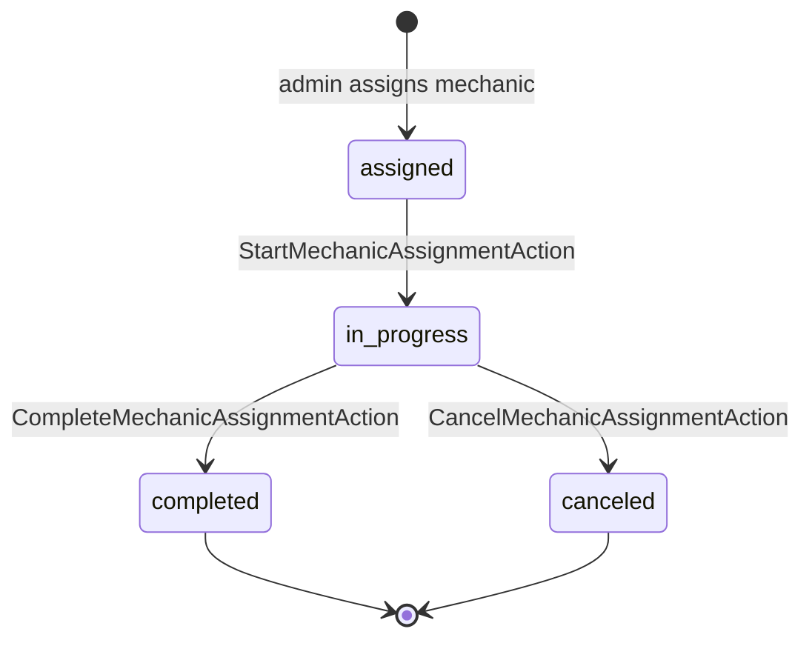
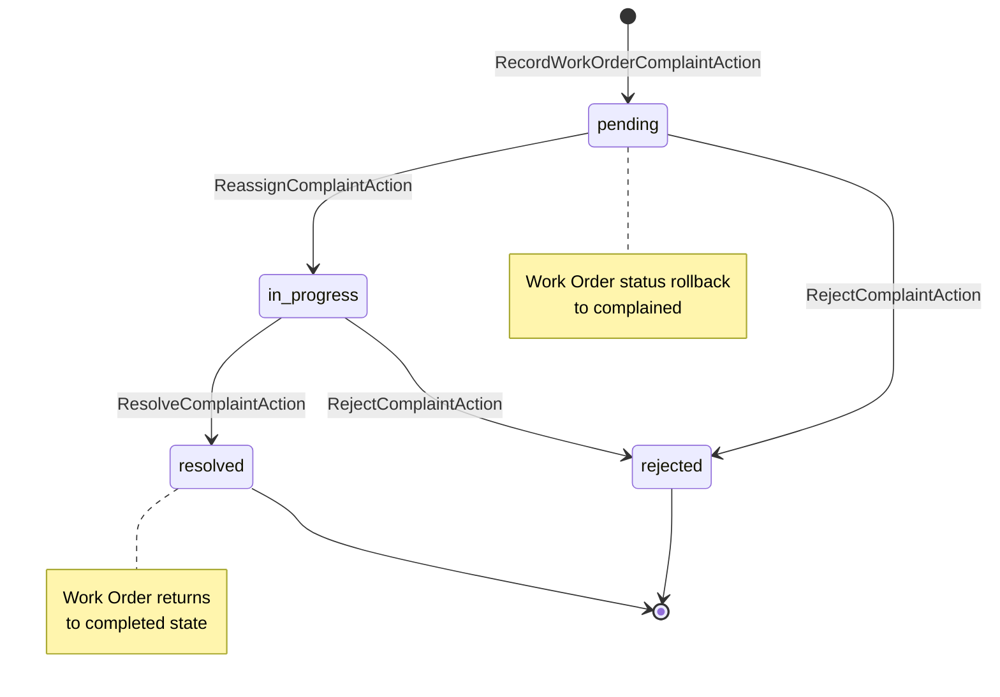
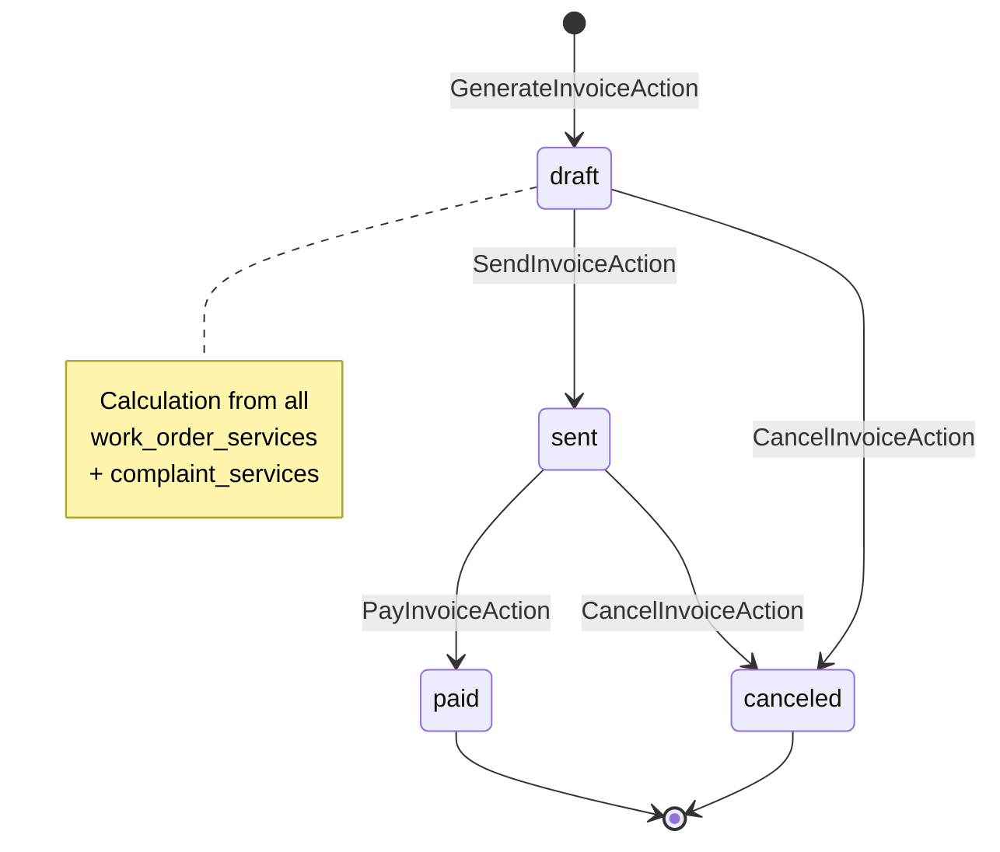
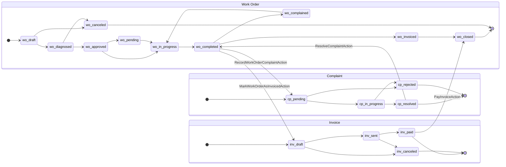

# Car Workshop System — Architecture Documentation

> **Stack:** Laravel · JWT Auth · PostgreSQL · Redis · Filament · Mailtrap SMTP · PHPUnit  
> **Pattern:** Repository Pattern + Action Classes (complex domain) + Service Layer (simple domain) + DTOs

> 📖 [Baca dalam Bahasa Indonesia](architecture.md)

---

## Table of Contents

- [Architecture Selection](#1-architecture-selection)
    - [Overview](#11-overview)
    - [Data Transfer Objects (DTOs)](#12-data-transfer-objects-dtos)
    - [Action Classes vs Service Layer](#13-action-classes-vs-service-layer)
    - [Action Classes for Complex Domains](#14-action-classes-for-complex-domains)
    - [Service Layer for Simple Domains](#15-service-layer-for-simple-domains)
    - [Repository Pattern](#16-repository-pattern)
    - [Event/Listener for Email Notifications](#17-eventlistener-for-email-notification)
    - [Architecture Summary](#18-architecture-summary)
- [Folder Structure](#2-folder-structure)
    - [Difference in Placement: Action Classes vs Service Layer](#21-difference-in-placement-action-classes-vs-service-layer)
- [Entity Relationship Diagram (ERD)](#3-entity-relationship-diagram-erd)
    - [Diagram](#31-diagram)
    - [ERD Design Decisions — Why This Way?](#32-erd-design-decisions--why-this-way)
- [State Machine Diagrams](#4-state-machine-diagrams)
    - [Work Order](#41-work-order)
    - [Work Order Service Item](#42-work-order-service-item)
    - [Mechanic Assignment](#43-mechanic-assignment)
    - [Complaint](#44-complaint)
    - [Invoice](#45-invoice)
    - [Combined All Entities](#46-combined-all-entities)
- [API Endpoints](#5-api-endpoints)
    - [Health Check](#51-health-check)
    - [Authentication](#52-authentication)
    - [Profile](#53-profile)
    - [Users](#54-users)
    - [Cars](#55-cars)
    - [Services](#56-services)
    - [Work Orders](#57-work-orders)
    - [Mechanic Assignments](#58-mechanic-assignments)
    - [Complaints](#59-complaints)
    - [Invoices](#510-invoices)
- [Development Phases](#6-development-phases)
- [Key Architectural Decisions](#7-key-architectural-decisions)
    - [Why DTOs?](#71-why-dtos)
    - [Why Separate Listeners per Event?](#72-why-separate-listeners-per-event)
    - [Why Enums for Status?](#73-why-enums-for-status)
    - [Why Separate ComplaintServiceRepository?](#74-why-separate-complaintservicerepository)
    - [Why MechanicAssignmentService Instead of Action Classes?](#75-why-mechanicassignmentservice-instead-of-action-classes)
- [Security & Authorization](#8-security--authorization)
    - [Role-Based Access Control (RBAC)](#81-role-based-access-control-rbac)
    - [Data Isolation](#82-data-isolation)
    - [Policies](#83-policies)
- [Testing Strategy](#9-testing-strategy)
    - [Unit Tests](#91-unit-tests)
    - [Feature Tests](#92-feature-tests)
    - [Test Tools](#93-test-tools)
- [Performance Considerations](#10-performance-considerations)
    - [Database Optimization](#101-database-optimization)
    - [Caching Strategy](#102-caching-strategy)
    - [Rate Limiting](#103-rate-limiting)

---

## 1. Architecture Selection

### 1.1 Overview

This workshop system uses a **hybrid** architecture with additional layers to separate concerns:

```
DTOs                →  Data Transfer Objects for input validation and type safety
Repository Pattern  →  Separates data access from business logic (used in all domains)
Action Classes      →  One class = one use case (for domains with complex state transitions & side effects)
Service Layer       →  One service = one domain (for CRUD domains with light business logic)
Enums               →  Structured and type-safe status states
```

Here are the characteristics of each domain:

| Domain                  | Approach       | Flow                                              | Reason                                                                                                          |
| ----------------------- | -------------- | ------------------------------------------------- | --------------------------------------------------------------------------------------------------------------- |
| **WorkOrders**          | Action Classes | DTO → Request → Controller → Action → Repository  | Many state transitions; each operation has different business rules, state validation, and side effects (email) |
| **Auth**                | Action Classes | DTO → Request → Controller → Action → Repository  | Each auth flow is an independent use case with different logic and side effects                                 |
| **Complaints**          | Action Classes | DTO → Request → Controller → Action → Repository  | Complex side effects: rollback WO status, re-assign mechanic, create new complaint services                     |
| **Invoices**            | Action Classes | DTO → Request → Controller → Action → Repository  | Price calculation from multiple sources, trigger email events, cross-entity orchestration                       |
| **Cars**                | Service Layer  | DTO → Request → Controller → Service → Repository | CRUD with light business logic; Service handles transformation, domain validation, and query orchestration      |
| **Services**            | Service Layer  | DTO → Request → Controller → Service → Repository | Master data CRUD; needs role-based access control and consistent filtering                                      |
| **Users**               | Service Layer  | DTO → Request → Controller → Service → Repository | CRUD with additional role management                                                                            |
| **MechanicAssignments** | Service Layer  | DTO → Request → Controller → Service → Repository | CRUD assignments with status transitions                                                                        |

---

### 1.2 Data Transfer Objects (DTOs)

DTOs are an additional layer that separates **input validation** from **business logic**. Each DTO represents a data structure for specific input.

**Benefits of DTOs:**

1. **Type Safety:** Input data is structured and typed before entering business logic
2. **Validation Logic:** Form request validation is separated into DTO constructor
3. **Immutability:** Data cannot be changed after creation, preventing side-effect bugs
4. **Reusability:** DTOs can be used in Actions, Services, or other places
5. **Documentation:** Clear and self-documenting input structure

**Example DTO:**

```php
// app/DTOs/WorkOrder/DiagnoseWorkOrderData.php
class DiagnoseWorkOrderData
{
    public function __construct(
        public readonly string $diagnosisNotes,
        public readonly array $services // array of service_id, price, notes
    ) {}
}
```

---

### 1.3 Action Classes vs Service Layer

Both are ways to place business logic outside the Controller, but with different granularity:

| Aspect           | Action Classes                                                                             | Service Layer                                                                             |
| ---------------- | ------------------------------------------------------------------------------------------ | ----------------------------------------------------------------------------------------- |
| **Granularity**  | One class = one use case                                                                   | One class = one domain                                                                    |
| **Suitable for** | Domains with many different operations, each having unique state validation & side effects | Domains with standard CRUD operations and business logic that can be grouped in one class |
| **Class Size**   | Small and focused (30–80 lines per action)                                                 | Medium (100–200 lines per service)                                                        |
| **Testing**      | Each use case tested in isolation                                                          | Each method tested within the same service context                                        |
| **Example**      | `DiagnoseWorkOrderAction`, `ReassignComplaintAction`                                       | `CarService::store()`, `UserService::changeRole()`                                        |

---

### 1.4 Action Classes for Complex Domains

**Tight Single Responsibility**

Each action class only does one thing. For example, in Work Order:

```
CreateWorkOrderAction.php             → Only creates new WO (draft)
DiagnoseWorkOrderAction.php           → Only handles draft → diagnosed transition + propose services
ApproveWorkOrderProposalAction.php    → Only handles owner approval → approved
AssignMechanicToServiceAction.php     → Only assigns mechanic to specific service item
StartWorkOrderServiceAction.php       → Only starts service item
CompleteWorkOrderServiceAction.php    → Only completes service item
CompleteMechanicAssignmentAction.php  → Only completes mechanic assignment
CancelMechanicAssignmentAction.php    → Only cancels mechanic assignment
CompleteWorkOrderAction.php           → Only handles completion of all services → completed
MarkWorkOrderAsInvoicedAction.php     → Only marks WO as invoiced + generate invoice
RecordWorkOrderComplaintAction.php    → Only records complaint on WO
UpdateWorkOrderAction.php             → Only updates basic WO data
CancelWorkOrderAction.php             → Only cancels WO
```

This approach answers the concrete problem from the task: _"assign mechanic"_, _"create complaint"_, _"send invoice"_, _"complete assignment"_, _"start service"_ are operations that **must not be mixed** in one service god-class.

---

### 1.5 Service Layer for Simple Domains

Domains like Cars, Services, Users, and MechanicAssignments don't have complex state machines or side effects. Service Layer is the right choice because:

- **Natural grouping:** All CRUD operations for one domain are in one place, easy to find
- **Logic reuse:** Methods like `CarService::getByOwner()` can be called from various points
- **Not over-engineered:** Creating one Action class per simple CRUD operation only adds files without real benefit

---

### 1.6 Repository Pattern

Repository pattern is used in **all domains** to **separate Eloquent from business logic**. This is important because:

1. **Unit Testing:** Service/Action can be tested with mock repository, without touching the database
2. **Query Consistency:** The same query is defined in one place
3. **Swap Implementation:** If ever need to change query engine or cache layer, only the repository needs to be changed

---

### 1.7 Event/Listener for Email Notification

Using Event/Listener ensures **decoupling** — action doesn't need to know how email is sent, only needs to dispatch event.

```
WorkOrderDiagnosed     → SendDiagnosisReviewNotificationListener → email to owner: "proposal services ready for review"
WorkOrderApproved      → SendWorkOrderApprovedNotificationListener → email to owner: "proposal approved"
WorkOrderCompleted     → SendWorkOrderCompletedNotificationListener → email to owner: "car ready for pickup"
MechanicAssigned       → SendMechanicAssignedNotificationListener → email to mechanic: "new assignment"
WorkOrderComplained    → (to be added) notification to admin
ComplaintResolved      → (to be added) notification to customer
SendWorkOrderInvoice   → SendWorkOrderInvoiceNotificationListener → email invoice to owner
UserRegistered         → SendWelcomeEmailListener → welcome email to new user
```

---

### 1.8 Architecture Summary

**Complex domains (WorkOrders, Auth, Complaints, Invoices):**

```
DTO             (App\DTOs\...)
   │
   ▼
FormRequest     (App\Http\Requests\Api\V1\...)
   │
   ▼
Controller      (App\Http\Controllers\Api\V1\...)
   │
   ▼
Action Class    (App\Actions\...)
   │
   ├──► Repository       (App\Repositories\Eloquent\...)
   │
   ├──► Event Dispatcher (App\Events\...)
   │
   └──► API Resource     (App\Http\Resources\Api\V1\...)
```

**Simple domains (Cars, Services, Users, MechanicAssignments):**

```
DTO             (App\DTOs\...)
   │
   ▼
FormRequest     (App\Http\Requests\Api\V1\...)
   │
   ▼
Controller      (App\Http\Controllers\Api\V1\...)
   │
   ▼
Service         (App\Services\...)
   │
   ▼
Repository      (App\Repositories\Eloquent\...)
   │
   └──► API Resource (App\Http\Resources\Api\V1\...)
```

---

## 2. Folder Structure

```
app/
├── Actions/                           ← Action Classes (one file = one use case)
│   ├── Auth/
│   │   ├── RegisterUser.php
│   │   └── ResetUserPassword.php
│   │
│   ├── Complaints/
│   │   ├── ReassignComplaintAction.php
│   │   ├── RejectComplaintAction.php
│   │   └── ResolveComplaintAction.php
│   │
│   ├── Invoices/
│   │   ├── CancelInvoiceAction.php
│   │   ├── GenerateInvoiceAction.php
│   │   ├── PayInvoiceAction.php
│   │   └── SendInvoiceAction.php
│   │
│   └── WorkOrders/
│       ├── ApproveWorkOrderProposalAction.php
│       ├── AssignMechanicToServiceAction.php
│       ├── CancelMechanicAssignmentAction.php
│       ├── CancelWorkOrderAction.php
│       ├── CompleteMechanicAssignmentAction.php
│       ├── CompleteWorkOrderAction.php
│       ├── CompleteWorkOrderServiceAction.php
│       ├── CreateWorkOrderAction.php
│       ├── DeleteWorkOrderAction.php
│       ├── DiagnoseWorkOrderAction.php
│       ├── MarkWorkOrderAsInvoicedAction.php
│       ├── RecordWorkOrderComplaintAction.php
│       ├── StartMechanicAssignmentAction.php
│       ├── StartWorkOrderServiceAction.php
│       └── UpdateWorkOrderAction.php
│
├── Concerns/                         ← Shared traits and behaviors
│
├── DTOs/                             ← Data Transfer Objects (input validation & type safety)
│   ├── Auth/
│   │   ├── LoginData.php
│   │   ├── RegisterData.php
│   │   └── ResetPasswordData.php
│   ├── Car/
│   │   ├── StoreCarData.php
│   │   └── UpdateCarData.php
│   ├── Complaint/
│   │   ├── AssignMechanicToComplaintServiceData.php
│   │   └── RecordComplaintData.php
│   ├── Invoice/
│   │   ├── GenerateInvoiceData.php
│   │   └── PayInvoiceData.php
│   ├── Mechanic/
│   │   └── MechanicAssignmentData.php
│   ├── Service/
│   │   ├── StoreServiceData.php
│   │   └── UpdateServiceData.php
│   ├── User/
│   │   ├── ChangeRoleData.php
│   │   ├── StoreUserData.php
│   │   ├── UpdateUserData.php
│   │   └── Profile/
│   └── WorkOrder/
│       ├── AssignMechanicData.php
│       ├── CreateWorkOrderData.php
│       ├── DiagnoseWorkOrderData.php
│       └── UpdateWorkOrderData.php
│
├── Enums/                            ← Type-safe status enums
│   ├── ComplaintStatus.php           → pending, in_progress, resolved, rejected
│   ├── InvoiceStatus.php             → draft, sent, paid, canceled
│   ├── MechanicAssignmentStatus.php  → assigned, in_progress, completed, canceled
│   ├── RoleType.php                  → super_admin, admin, mechanic, customer
│   ├── ServiceItemStatus.php         → pending, assigned, in_progress, completed, complained, canceled
│   └── WorkOrderStatus.php           → draft, diagnosed, approved, pending, in_progress, completed, invoiced, complained, closed, canceled
│
├── Events/                           ← Domain events
│   ├── ComplaintResolved.php
│   ├── MechanicAssigned.php
│   ├── SendWorkOrderInvoice.php
│   ├── UserRegistered.php
│   ├── WorkOrderApproved.php
│   ├── WorkOrderComplained.php
│   ├── WorkOrderCompleted.php
│   └── WorkOrderDiagnosed.php
│
├── Http/
│   ├── Controllers/
│   │   └── Api/
│   │       └── V1/
│   │           ├── HealthController.php
│   │           ├── Auth/
│   │           │   └── AuthController.php
│   │           ├── Car/
│   │           │   └── CarController.php
│   │           ├── Complaint/
│   │           │   └── ComplaintController.php
│   │           ├── Invoice/
│   │           │   └── InvoiceController.php
│   │           ├── Mechanic/
│   │           │   └── MechanicAssignmentController.php
│   │           ├── Service/
│   │           │   └── ServiceController.php
│   │           ├── User/
│   │           │   ├── ProfileController.php
│   │           │   └── UserController.php
│   │           └── WorkOrder/
│   │               └── WorkOrderController.php
│   │
│   ├── Requests/
│   │   └── Api/
│   │       └── V1/
│   │           ├── Auth/
│   │           ├── Car/
│   │           ├── Complaint/
│   │           ├── Invoice/
│   │           ├── Mechanic/
│   │           ├── Service/
│   │           ├── User/
│   │           └── WorkOrder/
│   │
│   └── Resources/
│       └── Api/
│           └── V1/
│               ├── Auth/
│               ├── Car/
│               ├── Complaint/
│               ├── Invoice/
│               ├── Mechanic/
│               ├── Service/
│               ├── User/
│               └── WorkOrder/
│
├── Listeners/                        ← Event handlers
│   ├── AssignDefaultRoleListener.php
│   ├── SendDiagnosisReviewNotificationListener.php
│   ├── SendMechanicAssignedNotificationListener.php
│   ├── SendWelcomeEmailListener.php
│   ├── SendWorkOrderApprovedNotificationListener.php
│   ├── SendWorkOrderCompletedNotificationListener.php
│   └── SendWorkOrderInvoiceNotificationListener.php
│
├── Models/
│   ├── Car.php
│   ├── Complaint.php
│   ├── ComplaintService.php
│   ├── Invoice.php
│   ├── MechanicAssignment.php
│   ├── Service.php
│   ├── User.php
│   ├── WorkOrder.php
│   └── WorkOrderService.php
│
├── Policies/                         ← Authorization policies
│   ├── CarPolicy.php
│   ├── ComplaintPolicy.php
│   ├── InvoicePolicy.php
│   ├── MechanicAssignmentPolicy.php
│   ├── RolePolicy.php
│   ├── ServicePolicy.php
│   ├── UserPolicy.php
│   └── WorkOrderPolicy.php
│
├── Repositories/
│   ├── Contracts/                    ← Interface definitions
│   │   ├── CarRepositoryInterface.php
│   │   ├── ComplaintRepositoryInterface.php
│   │   ├── ComplaintServiceRepositoryInterface.php
│   │   ├── InvoiceRepositoryInterface.php
│   │   ├── MechanicAssignmentRepositoryInterface.php
│   │   ├── ServiceRepositoryInterface.php
│   │   ├── UserRepositoryInterface.php
│   │   ├── WorkOrderRepositoryInterface.php
│   │   └── WorkOrderServiceRepositoryInterface.php
│   │
│   ├── Eloquent/                     ← Concrete Eloquent implementations
│   │   ├── CarRepository.php
│   │   ├── ComplaintRepository.php
│   │   ├── ComplaintServiceRepository.php
│   │   ├── InvoiceRepository.php
│   │   ├── MechanicAssignmentRepository.php
│   │   ├── ServiceRepository.php
│   │   ├── WorkOrderRepository.php
│   │   └── WorkOrderServiceRepository.php
│   │
│   └── UserRepository.php            ← Root-level (not in Eloquent/)
│
├── Services/                         ← Service Layer (simple domain CRUD)
│   ├── AuthService.php
│   ├── HealthCheckService.php
│   ├── InvoiceService.php
│   ├── Car/
│   │   └── CarService.php
│   ├── MechanicAssignment/
│   │   └── MechanicAssignmentService.php
│   ├── Service/
│   │   └── ServiceService.php
│   └── User/
│       ├── ProfileService.php
│       └── UserService.php
│
├── Support/                          ← Helper classes
│
└── Tests/
    ├── Unit/
    └── Feature/
```

---

### 2.1 Difference in Placement: Action Classes vs Service Layer

| Aspect              | Action Classes                                                           | Service Layer                                              |
| ------------------- | ------------------------------------------------------------------------ | ---------------------------------------------------------- |
| **Domain**          | WorkOrders, Auth, Complaints, Invoices                                   | Cars, Services, Users, MechanicAssignments                 |
| **Characteristics** | State transitions, side effects, and strict business rules per operation | CRUD + light domain logic that can be grouped in one class |
| **Granularity**     | One file = one use case                                                  | One file = one domain                                      |
| **File Size**       | Small (±30–80 lines)                                                     | Medium (±100–200 lines)                                    |
| **Example**         | `DiagnoseWorkOrderAction`, `ReassignComplaintAction`                     | `CarService::store()`, `UserService::changeRole()`         |

---

## 3. Entity Relationship Diagram (ERD)

### 3.1 Diagram

```mermaid
erDiagram
    users {
        uuid id PK
        string name
        string email
        string password
        string role "super_admin | admin | mechanic | customer"
        boolean is_active
        timestamp email_verified_at
        string phone
        timestamp created_at
        timestamp updated_at
        timestamp deleted_at
    }

    cars {
        uuid id PK
        uuid owner_id FK
        string plate_number
        string brand
        string model
        year year
        string color
        timestamp created_at
        timestamp updated_at
    }

    work_orders {
        uuid id PK
        string order_number
        uuid car_id FK
        uuid created_by FK
        string status "draft | diagnosed | approved | pending | in_progress | completed | invoiced | complained | closed | canceled"
        text diagnosis_notes
        date estimated_completion
        timestamp created_at
        timestamp updated_at
    }

    services {
        uuid id PK
        string name
        text description
        decimal base_price
        boolean is_active
        timestamp created_at
        timestamp updated_at
    }

    work_order_services {
        uuid id PK
        uuid work_order_id FK
        uuid service_id FK
        decimal price
        string status "pending | assigned | in_progress | completed | complained | canceled"
        text notes
        timestamp created_at
        timestamp updated_at
    }

    mechanic_assignments {
        uuid id PK
        uuid work_order_service_id FK (nullable)
        uuid complaint_service_id FK
        uuid mechanic_id FK
        string status "assigned | in_progress | completed | canceled"
        timestamp assigned_at
        timestamp completed_at
        timestamp created_at
        timestamp updated_at
    }

    complaints {
        uuid id PK
        uuid work_order_id FK
        text description
        string status "pending | in_progress | resolved | rejected"
        timestamp in_progress_at
        timestamp resolved_at
        timestamp rejected_at
        timestamp created_at
        timestamp updated_at
    }

    complaint_services {
        uuid id PK
        uuid complaint_id FK
        uuid service_id FK
        decimal price
        string status "pending | assigned | in_progress | completed | complained | canceled"
        text description
        timestamp created_at
        timestamp updated_at
    }

    invoices {
        uuid id PK
        string invoice_number
        uuid work_order_id FK
        uuid complaint_id FK (nullable)
        decimal subtotal
        decimal discount
        decimal tax
        decimal total
        string status "draft | sent | paid | canceled"
        date due_date
        string payment_method
        string payment_reference
        text payment_notes
        timestamp sent_at
        timestamp paid_at
        timestamp canceled_at
        timestamp created_at
        timestamp updated_at
        timestamp deleted_at
    }

    users ||--o{ cars : "owns"
    users ||--o{ work_orders : "creates"
    users ||--o{ mechanic_assignments : "performs as mechanic"

    cars ||--o{ work_orders : "has"

    work_orders ||--o{ work_order_services : "includes"
    work_orders ||--o{ complaints : "has"
    work_orders ||--o| invoices : "billed via"

    services ||--o{ work_order_services : "used in"
    services ||--o{ complaint_services : "used in"

    work_order_services ||--o{ mechanic_assignments : "assigned to"
    complaint_services ||--o{ mechanic_assignments : "assigned to"

    complaints ||--o{ complaint_services : "requires"
    complaints ||--o| invoices : "for complaint"
```

Full diagram:  
https://app.eraser.io/workspace/pyQzynPZ1MDcNw5mc3Sy?origin=share

---

### 3.2 ERD Design Decisions — Why This Way?

**Single `users` table with `role` column**

There are four actors: Super Admin, Admin, Customer, and Mechanic. All four use the same login system and have identical data structures (name, email, password). A `role` enum column (`super_admin | admin | customer | mechanic`) is sufficient to differentiate access and behavior of each actor.

**`work_order_services` table as stateful pivot**

Each service in a work order needs to be assigned to a mechanic separately, and each can complete at different times. Therefore, `work_order_services` is not just a regular pivot table — it has its own `status` column (`pending → assigned → in_progress → completed`) that represents the progress of each work item independently.

**Separate `mechanic_assignments` table from `work_order_services`**

The mechanic-to-service-item relationship is abstracted to a separate table. This anticipates the possibility that one service item might be re-assigned to another mechanic (e.g., due to a complaint), so the assignment history remains preserved and doesn't overwrite old data.

**`complaint_services` table follows the same pattern as `work_order_services`**

When a car owner files a complaint, the workshop needs to perform one or more additional services. This pattern is identical to a regular work order: services are added, mechanics are assigned, and there's a status per item. Instead of reusing `work_order_services`, a separate table is created so that:

- Complaint services are not mixed with the initial work order services
- Invoice calculation can differentiate between initial costs and remedial costs
- Audit trail is cleaner

**`invoices` table relates one-to-one with `work_order`**

Each work order only produces one invoice. This invoice covers the total of all `work_order_services` and all related `complaint_services`. This aligns with the business flow: the owner pays only once at the end, after all work (including complaint remedial work) is completed.

---

## 4. State Machine Diagrams

### 4.1 Work Order



**Work Order Status (10 states):**

| Status        | Description                                  | Transition From                                        | Transition To        |
| ------------- | -------------------------------------------- | ------------------------------------------------------ | -------------------- |
| `draft`       | New work order, not yet inspected            | CreateWorkOrderAction                                  | diagnosed, canceled  |
| `diagnosed`   | Mechanic has diagnosed, waiting for approval | DiagnoseWorkOrderAction                                | approved, canceled   |
| `approved`    | Customer agrees with proposal                | ApproveWorkOrderProposalAction                         | pending, in_progress |
| `pending`     | Waiting for spare parts/mechanic             | (manual from approved)                                 | in_progress          |
| `in_progress` | Mechanic is working                          | AssignMechanicToServiceAction, ReassignComplaintAction | completed            |
| `completed`   | All services completed                       | CompleteWorkOrderAction                                | complained, invoiced |
| `complained`  | Customer complained                          | RecordWorkOrderComplaintAction                         | in_progress (rework) |
| `invoiced`    | Invoice generated                            | MarkWorkOrderAsInvoicedAction                          | closed               |
| `closed`      | Payment completed                            | PayInvoiceAction                                       | [*] (final)          |
| `canceled`    | Work order canceled                          | CancelWorkOrderAction                                  | [*] (final)          |

---

### 4.2 Work Order Service Item



---

### 4.3 Mechanic Assignment



---

### 4.4 Complaint



**Complaint Status (4 states):**

| Status        | Description                 | Transition From                | Transition To         |
| ------------- | --------------------------- | ------------------------------ | --------------------- |
| `pending`     | New complaint, not reviewed | RecordWorkOrderComplaintAction | in_progress, rejected |
| `in_progress` | Being worked on (rework)    | ReassignComplaintAction        | resolved, rejected    |
| `resolved`    | Problem has been solved     | ResolveComplaintAction         | [*] (final)           |
| `rejected`    | Complaint rejected          | RejectComplaintAction          | [*] (final)           |

---

### 4.5 Invoice



**Invoice Status (4 states):**

| Status     | Description              | Transition From       | Transition To  |
| ---------- | ------------------------ | --------------------- | -------------- |
| `draft`    | New invoice, not sent    | GenerateInvoiceAction | sent, canceled |
| `sent`     | Invoice sent to customer | SendInvoiceAction     | paid, canceled |
| `paid`     | Invoice has been paid    | PayInvoiceAction      | [*] (final)    |
| `canceled` | Invoice canceled         | CancelInvoiceAction   | [*] (final)    |

---

### 4.6 Combined All Entities



---

## 5. API Endpoints

All routes are grouped under the `/api/v1` prefix and defined in `routes/api/v1.php`:

### 5.1 Health Check

| Method | Endpoint               | Handler                   | Description                       |
| ------ | ---------------------- | ------------------------- | --------------------------------- |
| GET    | `/api/v1/health/basic` | `HealthController::basic` | Basic health check (public)       |
| GET    | `/api/v1/health/full`  | `HealthController::full`  | Full health check (authenticated) |

---

### 5.2 Authentication

| Method | Endpoint                                       | Handler                                   | Description               |
| ------ | ---------------------------------------------- | ----------------------------------------- | ------------------------- |
| POST   | `/api/v1/auth/login`                           | `AuthController::login`                   | Login, returns JWT        |
| POST   | `/api/v1/auth/register`                        | `AuthController::register`                | Register new user         |
| POST   | `/api/v1/auth/forgot-password`                 | `AuthController::forgotPassword`          | Request password reset    |
| POST   | `/api/v1/auth/reset-password`                  | `AuthController::resetPassword`           | Reset password            |
| GET    | `/api/v1/auth/verify-email/{id}/{hash}`        | `AuthController::verifyEmail`             | Verify email (signed URL) |
| POST   | `/api/v1/auth/refresh`                         | `AuthController::refresh`                 | Refresh JWT token         |
| POST   | `/api/v1/auth/revoke`                          | `AuthController::revokeToken`             | Revoke JWT token          |
| POST   | `/api/v1/auth/email/verification-notification` | `AuthController::resendVerificationEmail` | Resend verification email |

---

### 5.3 Profile

| Method | Endpoint                          | Handler                             | Description     |
| ------ | --------------------------------- | ----------------------------------- | --------------- |
| GET    | `/api/v1/profile`                 | `ProfileController::show`           | View profile    |
| PUT    | `/api/v1/profile`                 | `ProfileController::update`         | Update profile  |
| POST   | `/api/v1/profile/change-password` | `ProfileController::changePassword` | Change password |
| PATCH  | `/api/v1/profile/avatar`          | `ProfileController::uploadAvatar`   | Upload avatar   |

---

### 5.4 Users

| Method    | Endpoint                           | Handler                        | Description               |
| --------- | ---------------------------------- | ------------------------------ | ------------------------- |
| GET       | `/api/v1/users`                    | `UserController::index`        | List users                |
| POST      | `/api/v1/users`                    | `UserController::store`        | Create user               |
| GET       | `/api/v1/users/{id}`               | `UserController::show`         | Get user details          |
| PUT/PATCH | `/api/v1/users/{id}`               | `UserController::update`       | Update user               |
| DELETE    | `/api/v1/users/{id}`               | `UserController::destroy`      | Delete user               |
| GET       | `/api/v1/users/trashed`            | `UserController::trashed`      | List trashed users        |
| POST      | `/api/v1/users/{id}/restore`       | `UserController::restore`      | Restore trashed user      |
| PATCH     | `/api/v1/users/{id}/toggle-active` | `UserController::toggleActive` | Toggle user active status |
| PATCH     | `/api/v1/users/{id}/role`          | `UserController::changeRole`   | Change user role          |

---

### 5.5 Cars

| Method    | Endpoint            | Handler                  | Description                     |
| --------- | ------------------- | ------------------------ | ------------------------------- |
| GET       | `/api/v1/cars`      | `CarController::index`   | List cars (with data isolation) |
| POST      | `/api/v1/cars`      | `CarController::store`   | Create car                      |
| GET       | `/api/v1/cars/{id}` | `CarController::show`    | Get car details                 |
| PUT/PATCH | `/api/v1/cars/{id}` | `CarController::update`  | Update car                      |
| DELETE    | `/api/v1/cars/{id}` | `CarController::destroy` | Delete car                      |

---

### 5.6 Services

| Method    | Endpoint                              | Handler                           | Description                  |
| --------- | ------------------------------------- | --------------------------------- | ---------------------------- |
| GET       | `/api/v1/services`                    | `ServiceController::index`        | List services                |
| POST      | `/api/v1/services`                    | `ServiceController::store`        | Create service               |
| GET       | `/api/v1/services/{id}`               | `ServiceController::show`         | Get service details          |
| PUT/PATCH | `/api/v1/services/{id}`               | `ServiceController::update`       | Update service               |
| DELETE    | `/api/v1/services/{id}`               | `ServiceController::destroy`      | Delete service               |
| PATCH     | `/api/v1/services/{id}/toggle-active` | `ServiceController::toggleActive` | Toggle service active status |

---

### 5.7 Work Orders

| Method    | Endpoint                                                            | Handler                                         | Description                            |
| --------- | ------------------------------------------------------------------- | ----------------------------------------------- | -------------------------------------- |
| GET       | `/api/v1/work-orders`                                               | `WorkOrderController::index`                    | List work orders (with data isolation) |
| POST      | `/api/v1/work-orders`                                               | `WorkOrderController::store`                    | Create work order                      |
| GET       | `/api/v1/work-orders/{id}`                                          | `WorkOrderController::show`                     | Get work order details                 |
| PUT/PATCH | `/api/v1/work-orders/{id}`                                          | `WorkOrderController::update`                   | Update work order                      |
| PATCH     | `/api/v1/work-orders/{id}/diagnose`                                 | `WorkOrderController::diagnose`                 | Diagnose work order                    |
| PATCH     | `/api/v1/work-orders/{id}/approve`                                  | `WorkOrderController::approve`                  | Approve work order                     |
| PATCH     | `/api/v1/work-orders/{id}/complete`                                 | `WorkOrderController::complete`                 | Complete work order                    |
| PATCH     | `/api/v1/work-orders/{id}/cancel`                                   | `WorkOrderController::cancel`                   | Cancel work order                      |
| PATCH     | `/api/v1/work-orders/{id}/mark-invoiced`                            | `WorkOrderController::markAsInvoiced`           | Mark as invoiced                       |
| PATCH     | `/api/v1/work-orders/{id}/record-complaint`                         | `WorkOrderController::recordComplaint`          | Record complaint                       |
| PATCH     | `/api/v1/work-orders/services/{workOrderServiceId}/assign-mechanic` | `WorkOrderController::assignMechanic`           | Assign mechanic to service             |
| PATCH     | `/api/v1/work-orders/services/{workOrderServiceId}/start`           | `WorkOrderController::startService`             | Start work order service               |
| PATCH     | `/api/v1/work-orders/services/{workOrderServiceId}/complete`        | `WorkOrderController::completeService`          | Complete work order service            |
| PATCH     | `/api/v1/work-orders/assignments/{assignmentId}/cancel`             | `WorkOrderController::cancelMechanicAssignment` | Cancel mechanic assignment             |

---

### 5.8 Mechanic Assignments

| Method    | Endpoint                                     | Handler                                  | Description                            |
| --------- | -------------------------------------------- | ---------------------------------------- | -------------------------------------- |
| GET       | `/api/v1/mechanic-assignments`               | `MechanicAssignmentController::index`    | List assignments (with data isolation) |
| POST      | `/api/v1/mechanic-assignments`               | `MechanicAssignmentController::store`    | Create assignment                      |
| GET       | `/api/v1/mechanic-assignments/{id}`          | `MechanicAssignmentController::show`     | Get assignment details                 |
| PUT/PATCH | `/api/v1/mechanic-assignments/{id}`          | `MechanicAssignmentController::update`   | Update assignment                      |
| PATCH     | `/api/v1/mechanic-assignments/{id}/start`    | `MechanicAssignmentController::start`    | Start assignment                       |
| PATCH     | `/api/v1/mechanic-assignments/{id}/complete` | `MechanicAssignmentController::complete` | Complete assignment                    |
| PATCH     | `/api/v1/mechanic-assignments/{id}/cancel`   | `MechanicAssignmentController::cancel`   | Cancel assignment                      |

---

### 5.9 Complaints

| Method | Endpoint                                                           | Handler                               | Description                           |
| ------ | ------------------------------------------------------------------ | ------------------------------------- | ------------------------------------- |
| GET    | `/api/v1/complaints`                                               | `ComplaintController::index`          | List complaints (with data isolation) |
| GET    | `/api/v1/complaints/{id}`                                          | `ComplaintController::show`           | Get complaint details                 |
| PATCH  | `/api/v1/complaints/{id}/reassign`                                 | `ComplaintController::reassign`       | Reassign complaint for rework         |
| PATCH  | `/api/v1/complaints/{id}/resolve`                                  | `ComplaintController::resolve`        | Resolve complaint                     |
| PATCH  | `/api/v1/complaints/{id}/reject`                                   | `ComplaintController::reject`         | Reject complaint                      |
| PATCH  | `/api/v1/complaints/services/{complaintServiceId}/assign-mechanic` | `ComplaintController::assignMechanic` | Assign mechanic to complaint service  |

---

### 5.10 Invoices

| Method | Endpoint                       | Handler                       | Description                         |
| ------ | ------------------------------ | ----------------------------- | ----------------------------------- |
| GET    | `/api/v1/invoices`             | `InvoiceController::index`    | List invoices (with data isolation) |
| POST   | `/api/v1/invoices/generate`    | `InvoiceController::generate` | Generate invoice                    |
| GET    | `/api/v1/invoices/{id}`        | `InvoiceController::show`     | Get invoice details                 |
| PATCH  | `/api/v1/invoices/{id}/send`   | `InvoiceController::send`     | Send invoice                        |
| PATCH  | `/api/v1/invoices/{id}/pay`    | `InvoiceController::pay`      | Pay invoice                         |
| PATCH  | `/api/v1/invoices/{id}/cancel` | `InvoiceController::cancel`   | Cancel invoice                      |

---

## 6. Development Phases

### Phase 1 — Foundation & Auth

Setup Laravel project, JWT auth, implement `RegisterUser` / `ResetUserPassword` action classes, setup `UserService` with `UserRepository` for user management (store, update, changeRole, toggleActive), setup `ProfileService` for profile management. Setup `AuthService`. Database migrations & seeders.

### Phase 2 — Service

Implement `ServiceService` with `ServiceRepository` for CRUD master data services (store, update, toggleActive). Add policy to restrict access to Admin role only.

### Phase 3 — Car Management

Implement `CarService` with `CarRepository` for CRUD cars (store, update, destroy, getByOwner). Implement validation for license plate format.

### Phase 4 — Work Order Core

`CreateWorkOrderAction`, `DiagnoseWorkOrderAction`, `ApproveWorkOrderProposalAction` — including state validation in each action, event & listener setup for email notifications (`WorkOrderDiagnosed`, `WorkOrderApproved` events).

### Phase 5 — Mechanic Assignment & Execution

`AssignMechanicToServiceAction`, `StartWorkOrderServiceAction`, `CompleteWorkOrderServiceAction`, `StartMechanicAssignmentAction`, `CompleteMechanicAssignmentAction`, `CancelMechanicAssignmentAction` with email notification to mechanic, update status per service item, `CompleteWorkOrderAction` with auto-complete logic (all items done → WO completed), email to owner that car is ready for pickup.

### Phase 6 — Complaint Handling

`RecordWorkOrderComplaintAction` with WO status rollback to `complained`, creation of new complaint services, re-assign mechanic. `ReassignComplaintAction`, `ResolveComplaintAction`, `RejectComplaintAction` for managing complaint lifecycle.

### Phase 7 — Invoice & Closing

`GenerateInvoiceAction` with subtotal calculation from `work_order_services` + `complaint_services`, tax/discount/total calculation, `SendWorkOrderInvoice` event → send via Mailtrap. `PayInvoiceAction`, `CancelInvoiceAction` → WO to `closed` or rollback.

### Phase 8 — Unit Tests & Polish

Unit test per action class (especially state transition validation and invalid state negative cases). Unit test per service class (CarService, UserService, ServiceService). Feature test for each API endpoint, test email notification fire via event fake, test invoice calculation.

---

## 7. Key Architectural Decisions

### 7.1 Why DTOs?

DTOs provide **type-safe input validation** that's separate from both FormRequests and Business Logic. This creates a clear boundary:

- **FormRequest**: HTTP layer validation (auth, rate limiting, basic rules)
- **DTO**: Domain layer validation (business rules, data transformation)
- **Action/Service**: Pure business logic

### 7.2 Why Separate Listeners per Event?

Instead of a single `SendEmailNotification` listener, we use dedicated listeners because:

- **Single Responsibility**: Each listener handles one specific email type
- **Easier Testing**: Can mock specific listeners independently
- **Clear Intent**: Code is self-documenting
- **Flexibility**: Can easily add additional logic per email type

### 7.3 Why Enums for Status?

Using PHP 8.1 Enums provides:

- **Type Safety**: Compiler catches invalid status values
- **IDE Support**: Autocomplete and refactoring
- **Self-Documenting**: Status values are explicitly defined
- **Filament Integration**: Colors and labels built-in

### 7.4 Why Separate ComplaintServiceRepository?

Even though `ComplaintService` is similar to `WorkOrderService`, they serve different purposes:

- **Audit Trail**: Separates initial work from remedial work
- **Pricing**: Can have different pricing structures
- **Reporting**: Easier to generate separate reports for complaints

### 7.5 Why MechanicAssignmentService Instead of Action Classes?

Mechanic assignments have simpler state transitions and don't require complex orchestration. A service layer is sufficient and more maintainable for CRUD operations with basic status updates.

---

## 8. Security & Authorization

### 8.1 Role-Based Access Control (RBAC)

Four roles are defined in `RoleType` enum:

1. **Super Admin**: Full system access, can manage all resources and users
2. **Admin**: Workshop operations manager, can manage work orders, assign mechanics
3. **Mechanic**: Workshop staff, can view assigned work and update their own assignments
4. **Customer**: Car owners, can create work orders, approve diagnoses, and view their own orders

### 8.2 Data Isolation

- **Customers** see only their own cars and work orders
- **Mechanics** see only work orders where they have active assignments
- **Admins/Super Admins** see all data
- **Invoices** are isolated by car ownership (customers see only their own invoices)

### 8.3 Policies

Each domain has a corresponding Policy class in `app/Policies/`:

- `CarPolicy`
- `ComplaintPolicy`
- `InvoicePolicy`
- `MechanicAssignmentPolicy`
- `RolePolicy`
- `ServicePolicy`
- `UserPolicy`
- `WorkOrderPolicy`

Policies implement `before()` hook to check if user is active before any authorization check.

---

## 9. Testing Strategy

### 9.1 Unit Tests

- **Action Classes**: Test state transitions, business rules, and edge cases
- **Services**: Test CRUD operations, business logic, and validations
- **DTOs**: Test data validation and transformation
- **Repositories**: Test query logic and data access

### 9.2 Feature Tests

- **API Endpoints**: Test request/response, authorization, and data isolation
- **Authentication**: Test login, registration, password reset flows
- **Email Notifications**: Test event firing and listener execution
- **State Machines**: Test complete workflows through all states

### 9.3 Test Tools

- **PHPUnit**: Main testing framework
- **Laravel Event Fake**: Mock events for testing listeners
- **Laravel Queue Fake**: Test queued jobs without actual execution
- **RefreshDatabase**: Fresh database for each test

---

## 10. Performance Considerations

### 10.1 Database Optimization

- **Indexes**: Proper indexing on foreign keys and frequently queried columns
- **Eager Loading**: Use `with()` to prevent N+1 queries
- **Query Caching**: Cache frequently accessed data like active services

### 10.2 Caching Strategy

- **Redis**: Used for caching active sessions, rate limiting, and frequently accessed data
- **Cache Tags**: Tag cache by domain for easy invalidation

### 10.3 Rate Limiting

- **Auth Endpoints**: Strict rate limiting (3/1 in production)
- **API Endpoints**: Standard rate limiting (60/1)
- **Local Development**: Relaxed rate limiting (100/1)

---

**Document Version:** 2.0  
**Last Updated:** April 15, 2026  
**API Version:** v1.0
