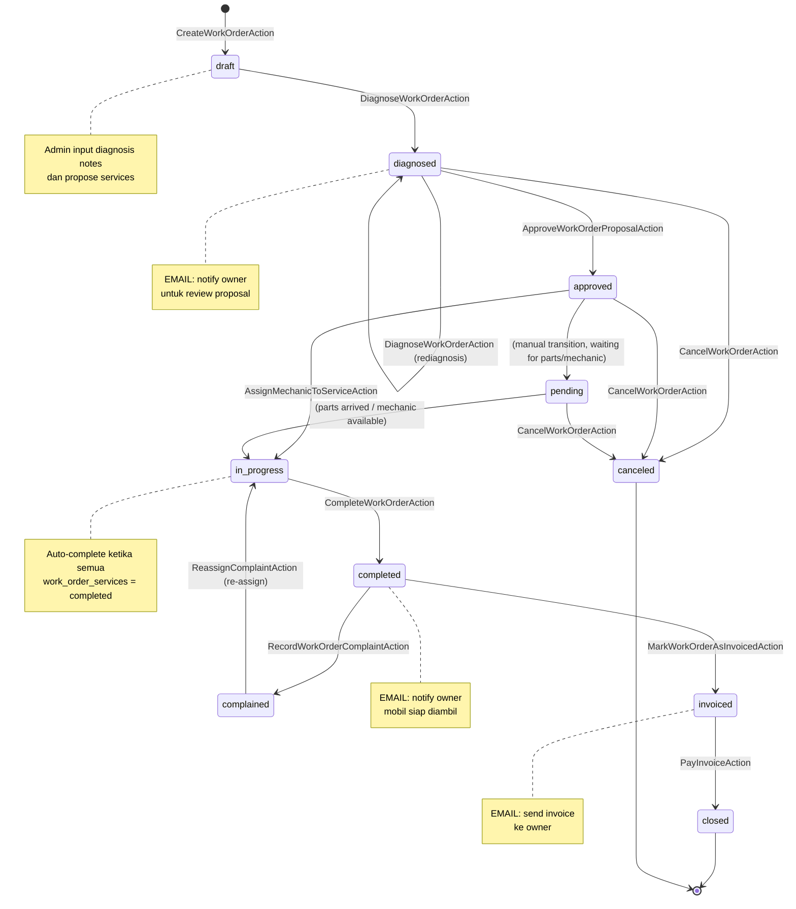
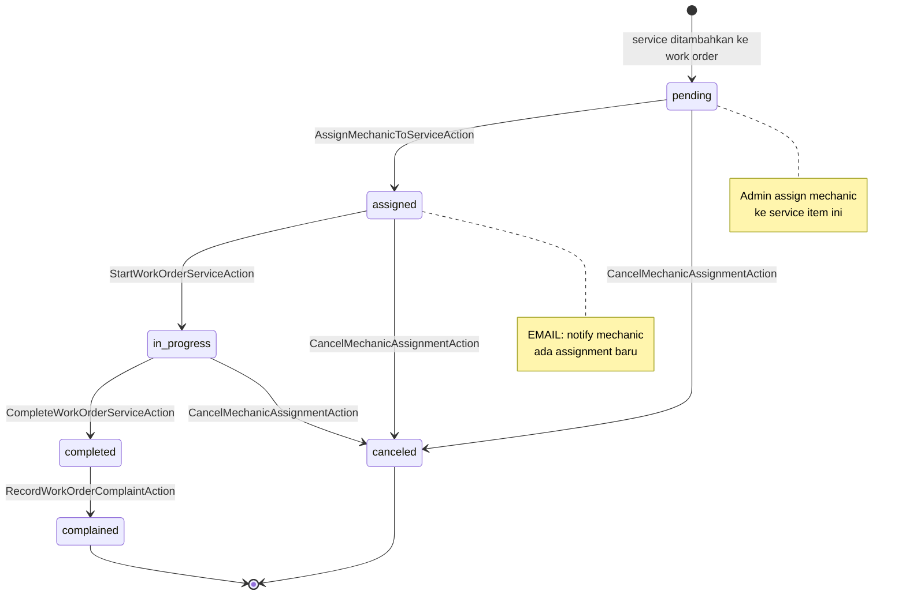
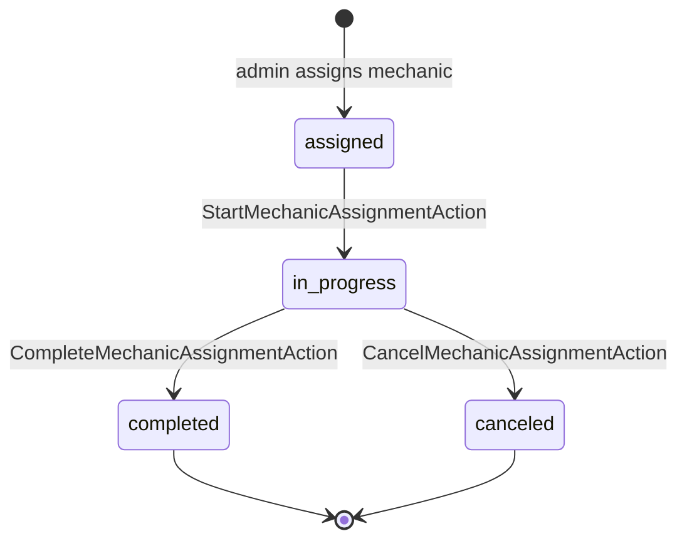
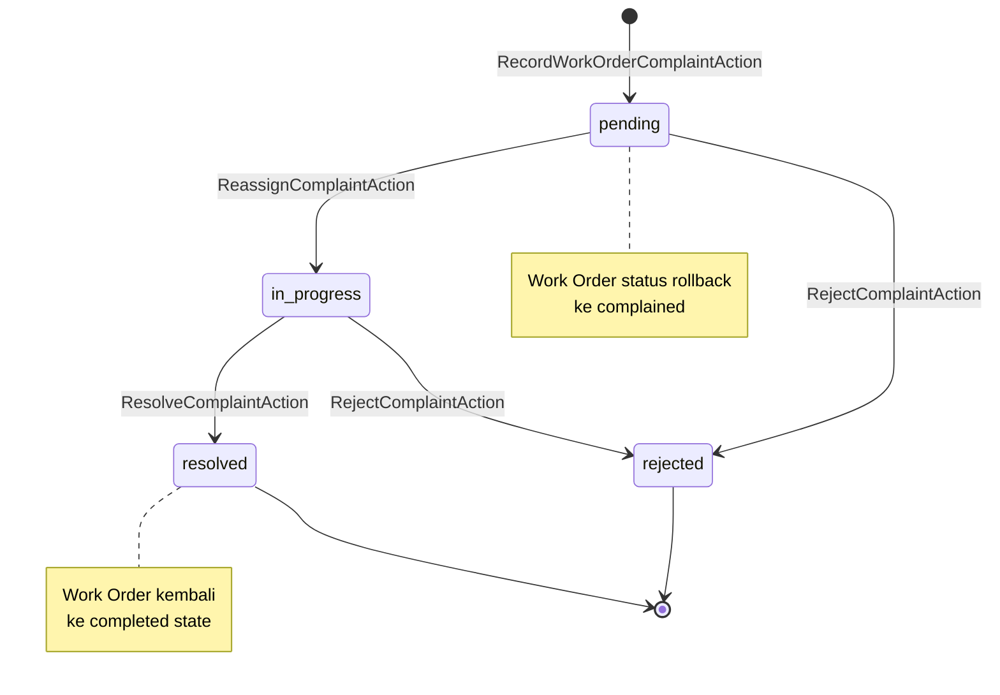
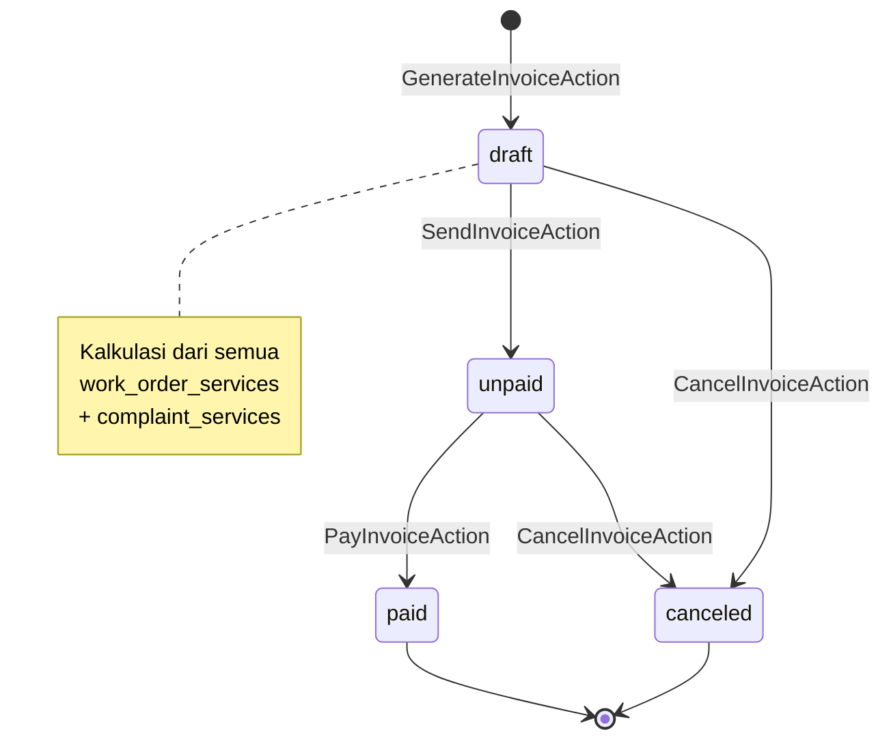
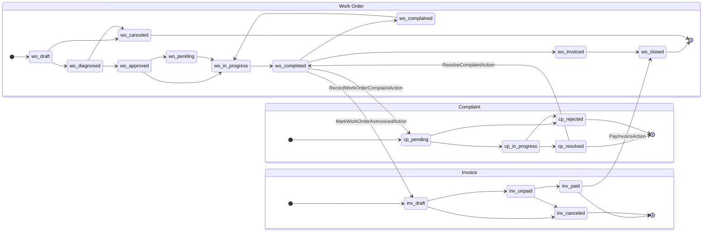

# Car Workshop System — Architecture Documentation

> **Stack:** Laravel · JWT Auth · PostgreSQL · Redis · Filament · Mailtrap SMTP · PHPUnit  
> **Pattern:** Repository Pattern + Action Classes (domain kompleks) + Service Layer (domain sederhana) + DTOs

---

## 1. Pemilihan Arsitektur

### 1.1 Gambaran Umum

Sistem bengkel ini menggunakan arsitektur **hybrid** dengan beberapa lapisan tambahan untuk memisahkan concern:

```
DTOs                →  Data Transfer Objects untuk input validation dan type safety
Repository Pattern  →  Memisahkan data access dari business logic (digunakan di semua domain)
Action Classes      →  Satu class = satu use case (untuk domain dengan state transition & side effect kompleks)
Service Layer       →  Satu service = satu domain (untuk domain CRUD dengan logika bisnis ringan)
Enums               →  Status states terstruktur dan type-safe
```

Berikut merupakan karakteristik dari masing-masing domain:

| Domain                  | Pendekatan     | Alur                                              | Alasan                                                                                                            |
| ----------------------- | -------------- | ------------------------------------------------- | ----------------------------------------------------------------------------------------------------------------- |
| **WorkOrders**          | Action Classes | DTO → Request → Controller → Action → Repository  | Banyak state transition; setiap operasi punya business rule, validasi state, dan side effect (email) yang berbeda |
| **Auth**                | Action Classes | DTO → Request → Controller → Action → Repository  | Setiap alur auth adalah use case independen dengan logika dan side effect berbeda                                 |
| **Complaints**          | Action Classes | DTO → Request → Controller → Action → Repository  | Side effect kompleks: rollback WO status, re-assign mechanic, buat complaint services baru                        |
| **Invoices**            | Action Classes | DTO → Request → Controller → Action → Repository  | Kalkulasi harga multi-sumber, trigger email event, orchestration lintas entitas                                   |
| **Cars**                | Service Layer  | DTO → Request → Controller → Service → Repository | CRUD dengan logika bisnis ringan; Service menangani transformasi, validasi domain, dan orkestrasi query           |
| **Services**            | Service Layer  | DTO → Request → Controller → Service → Repository | CRUD master data; butuh kontrol akses berbasis role dan filtering yang konsisten                                  |
| **Users**               | Service Layer  | DTO → Request → Controller → Service → Repository | CRUD dengan tambahan role management                                                                              |
| **MechanicAssignments** | Service Layer  | DTO → Request → Controller → Service → Repository | CRUD assignments dengan status transitions                                                                        |

---

### 1.2 Data Transfer Objects (DTOs)

DTOs adalah lapisan tambahan yang memisahkan **input validation** dari **business logic**. Setiap DTO merepresentasikan data structure untuk input tertentu.

**Manfaat DTOs:**

1. **Type Safety:** Input data terstruktur dan typed sebelum masuk ke business logic
2. **Validation Logic:** Validasi form request dipisah ke dalam DTO constructor
3. **Immutability:** Data tidak bisa diubah setelah dibuat, mencegah bug side-effect
4. **Reusability:** DTO bisa digunakan di Action, Service, atau tempat lain
5. **Documentation:** Struktur input yang jelas dan self-documenting

**Contoh DTO:**

```php
// app/DTOs/WorkOrder/DiagnoseWorkOrderData.php
class DiagnoseWorkOrderData
{
    public function __construct(
        public readonly string $diagnosisNotes,
        public readonly array $services // array of service_id, price, notes
    ) {}
}
```

---

### 1.3 Action Classes vs Service Layer

Keduanya adalah cara untuk menempatkan business logic di luar Controller, namun dengan granularitas yang berbeda:

| Aspek            | Action Classes                                                                                    | Service Layer                                                                                  |
| ---------------- | ------------------------------------------------------------------------------------------------- | ---------------------------------------------------------------------------------------------- |
| **Granularitas** | Satu class = satu use case                                                                        | Satu class = satu domain                                                                       |
| **Cocok untuk**  | Domain dengan banyak operasi berbeda yang masing-masing punya state validation & side effect unik | Domain dengan operasi CRUD standar dan logika bisnis yang dapat dikelompokkan dalam satu class |
| **Ukuran kelas** | Kecil dan terfokus (30–80 baris per action)                                                       | Sedang (100–200 baris per service)                                                             |
| **Testing**      | Setiap use case ditest secara terisolasi                                                          | Setiap method ditest dalam konteks service yang sama                                           |
| **Contoh**       | `DiagnoseWorkOrderAction`, `ReassignComplaintAction`                                              | `CarService::store()`, `UserService::changeRole()`                                             |

---

### 1.4 Action Classes untuk Domain Kompleks

**Single Responsibility yang Ketat**

Setiap action class hanya mengerjakan satu hal. Sebagai contoh pada Work Order:

```
CreateWorkOrderAction.php             → Hanya membuat WO baru (draft)
DiagnoseWorkOrderAction.php           → Hanya menangani transisi draft → diagnosed + propose services
ApproveWorkOrderProposalAction.php    → Hanya menangani owner approval → approved
AssignMechanicToServiceAction.php     → Hanya assign mechanic ke service item tertentu
StartWorkOrderServiceAction.php       → Hanya memulai service item
CompleteWorkOrderServiceAction.php    → Hanya menyelesaikan service item
CompleteMechanicAssignmentAction.php  → Hanya menyelesaikan mechanic assignment
CancelMechanicAssignmentAction.php    → Hanya membatalkan mechanic assignment
CompleteWorkOrderAction.php           → Hanya menangani penyelesaian semua service → completed
MarkWorkOrderAsInvoicedAction.php     → Hanya menandai WO sebagai invoiced + generate invoice
RecordWorkOrderComplaintAction.php    → Hanya merekam complaint pada WO
UpdateWorkOrderAction.php             → Hanya update data dasar WO
CancelWorkOrderAction.php             → Hanya cancel WO
```

Pendekatan ini menjawab masalah konkret dari soal: _"assign mechanic"_, _"buat complaint"_, _"send invoice"_, _"complete assignment"_, _"start service"_ adalah operasi-operasi yang **tidak boleh dicampur** dalam satu service god-class.

---

### 1.5 Service Layer untuk Domain Sederhana

Domain seperti Cars, Services, Users, dan MechanicAssignments tidak memiliki state machine atau side effect yang kompleks. Service Layer adalah pilihan yang tepat karena:

- **Grouping yang natural**: Semua operasi CRUD satu domain ada di satu tempat, mudah ditemukan
- **Reuse logika**: Metode seperti `CarService::getByOwner()` bisa dipanggil dari berbagai titik
- **Tidak over-engineered**: Membuat satu Action class per operasi CRUD sederhana hanya menambah file tanpa manfaat nyata

---

### 1.6 Repository Pattern

Repository pattern digunakan di **semua domain** untuk **memisahkan Eloquent dari business logic**. Ini penting karena:

1. **Unit Testing**: Service/Action bisa ditest dengan mock repository, tanpa menyentuh database
2. **Konsistensi Query**: Query yang sama didefinisikan di satu tempat
3. **Swap Implementation**: Jika suatu saat perlu ganti query engine atau cache layer, hanya repository yang perlu diubah

---

### 1.7 Event/Listener untuk Email Notification

Menggunakan Event/Listener memastikan **decoupling** — action tidak perlu tahu bagaimana email dikirim, hanya perlu dispatch event.

```
WorkOrderDiagnosed     → SendDiagnosisReviewNotificationListener → email ke owner: "proposal services siap di-review"
WorkOrderApproved      → SendWorkOrderApprovedNotificationListener → email ke owner: "proposal disetujui"
WorkOrderCompleted     → SendWorkOrderCompletedNotificationListener → email ke owner: "mobil siap diambil"
MechanicAssigned       → SendMechanicAssignedNotificationListener → email ke mechanic: "ada assignment baru"
WorkOrderComplained    → (akan ditambah) notification ke admin
ComplaintResolved      → (akan ditambah) notification ke customer
SendWorkOrderInvoice   → SendWorkOrderInvoiceNotificationListener → email invoice ke owner
UserRegistered         → SendWelcomeEmailListener → email welcome ke user baru
```

---

### 1.8 Ringkasan Arsitektur

**Domain kompleks (WorkOrders, Auth, Complaints, Invoices):**

```
DTO             (App\DTOs\...)
   │
   ▼
FormRequest     (App\Http\Requests\Api\V1\...)
   │
   ▼
Controller      (App\Http\Controllers\Api\V1\...)
   │
   ▼
Action Class    (App\Actions\...)
   │
   ├──► Repository       (App\Repositories\Eloquent\...)
   │
   ├──► Event Dispatcher (App\Events\...)
   │
   └──► API Resource     (App\Http\Resources\Api\V1\...)
```

**Domain sederhana (Cars, Services, Users, MechanicAssignments):**

```
DTO             (App\DTOs\...)
   │
   ▼
FormRequest     (App\Http\Requests\Api\V1\...)
   │
   ▼
Controller      (App\Http\Controllers\Api\V1\...)
   │
   ▼
Service         (App\Services\...)
   │
   ▼
Repository      (App\Repositories\Eloquent\...)
   │
   └──► API Resource (App\Http\Resources\Api\V1\...)
```

---

## 2. Struktur Folder

```
app/
├── Actions/                           ← Action Classes (satu file = satu use case)
│   ├── Auth/
│   │   ├── RegisterUser.php
│   │   └── ResetUserPassword.php
│   │
│   ├── Complaints/
│   │   ├── ReassignComplaintAction.php
│   │   ├── RejectComplaintAction.php
│   │   └── ResolveComplaintAction.php
│   │
│   ├── Invoices/
│   │   ├── CancelInvoiceAction.php
│   │   ├── GenerateInvoiceAction.php
│   │   ├── PayInvoiceAction.php
│   │   └── SendInvoiceAction.php
│   │
│   └── WorkOrders/
│       ├── ApproveWorkOrderProposalAction.php
│       ├── AssignMechanicToServiceAction.php
│       ├── CancelMechanicAssignmentAction.php
│       ├── CancelWorkOrderAction.php
│       ├── CompleteMechanicAssignmentAction.php
│       ├── CompleteWorkOrderAction.php
│       ├── CompleteWorkOrderServiceAction.php
│       ├── CreateWorkOrderAction.php
│       ├── DeleteWorkOrderAction.php
│       ├── DiagnoseWorkOrderAction.php
│       ├── MarkWorkOrderAsInvoicedAction.php
│       ├── RecordWorkOrderComplaintAction.php
│       ├── StartMechanicAssignmentAction.php
│       ├── StartWorkOrderServiceAction.php
│       └── UpdateWorkOrderAction.php
│
├── Concerns/                         ← Shared traits and behaviors
│
├── DTOs/                             ← Data Transfer Objects (input validation & type safety)
│   ├── Auth/
│   │   ├── LoginData.php
│   │   ├── RegisterData.php
│   │   └── ResetPasswordData.php
│   ├── Car/
│   │   ├── StoreCarData.php
│   │   └── UpdateCarData.php
│   ├── Complaint/
│   │   ├── AssignMechanicToComplaintServiceData.php
│   │   └── RecordComplaintData.php
│   ├── Invoice/
│   │   ├── GenerateInvoiceData.php
│   │   └── PayInvoiceData.php
│   ├── Mechanic/
│   │   └── MechanicAssignmentData.php
│   ├── Service/
│   │   ├── StoreServiceData.php
│   │   └── UpdateServiceData.php
│   ├── User/
│   │   ├── ChangeRoleData.php
│   │   ├── StoreUserData.php
│   │   ├── UpdateUserData.php
│   │   └── Profile/
│   └── WorkOrder/
│       ├── AssignMechanicData.php
│       ├── CreateWorkOrderData.php
│       ├── DiagnoseWorkOrderData.php
│       └── UpdateWorkOrderData.php
│
├── Enums/                            ← Type-safe status enums
│   ├── ComplaintStatus.php           → pending, in_progress, resolved, rejected
│   ├── InvoiceStatus.php             → draft, unpaid, paid, canceled
│   ├── MechanicAssignmentStatus.php  → assigned, in_progress, completed, canceled
│   ├── RoleType.php                  → super_admin, admin, mechanic, customer
│   ├── ServiceItemStatus.php         → pending, assigned, in_progress, completed, complained, canceled
│   └── WorkOrderStatus.php           → draft, diagnosed, approved, pending, in_progress, completed, invoiced, complained, closed, canceled
│
├── Events/                           ← Domain events
│   ├── ComplaintResolved.php
│   ├── MechanicAssigned.php
│   ├── SendWorkOrderInvoice.php
│   ├── UserRegistered.php
│   ├── WorkOrderApproved.php
│   ├── WorkOrderComplained.php
│   ├── WorkOrderCompleted.php
│   └── WorkOrderDiagnosed.php
│
├── Http/
│   ├── Controllers/
│   │   └── Api/
│   │       └── V1/
│   │           ├── HealthController.php
│   │           ├── Auth/
│   │           │   └── AuthController.php
│   │           ├── Car/
│   │           │   └── CarController.php
│   │           ├── Complaint/
│   │           │   └── ComplaintController.php
│   │           ├── Invoice/
│   │           │   └── InvoiceController.php
│   │           ├── Mechanic/
│   │           │   └── MechanicAssignmentController.php
│   │           ├── Service/
│   │           │   └── ServiceController.php
│   │           ├── User/
│   │           │   ├── ProfileController.php
│   │           │   └── UserController.php
│   │           └── WorkOrder/
│   │               └── WorkOrderController.php
│   │
│   ├── Requests/
│   │   └── Api/
│   │       └── V1/
│   │           ├── Auth/
│   │           ├── Car/
│   │           ├── Complaint/
│   │           ├── Invoice/
│   │           ├── Mechanic/
│   │           ├── Service/
│   │           ├── User/
│   │           └── WorkOrder/
│   │
│   └── Resources/
│       └── Api/
│           └── V1/
│               ├── Auth/
│               ├── Car/
│               ├── Complaint/
│               ├── Invoice/
│               ├── Mechanic/
│               ├── Service/
│               ├── User/
│               └── WorkOrder/
│
├── Listeners/                        ← Event handlers
│   ├── AssignDefaultRoleListener.php
│   ├── SendDiagnosisReviewNotificationListener.php
│   ├── SendMechanicAssignedNotificationListener.php
│   ├── SendWelcomeEmailListener.php
│   ├── SendWorkOrderApprovedNotificationListener.php
│   ├── SendWorkOrderCompletedNotificationListener.php
│   └── SendWorkOrderInvoiceNotificationListener.php
│
├── Models/
│   ├── Car.php
│   ├── Complaint.php
│   ├── ComplaintService.php
│   ├── Invoice.php
│   ├── MechanicAssignment.php
│   ├── Service.php
│   ├── User.php
│   ├── WorkOrder.php
│   └── WorkOrderService.php
│
├── Policies/                         ← Authorization policies
│   ├── CarPolicy.php
│   ├── ComplaintPolicy.php
│   ├── InvoicePolicy.php
│   ├── MechanicAssignmentPolicy.php
│   ├── RolePolicy.php
│   ├── ServicePolicy.php
│   ├── UserPolicy.php
│   └── WorkOrderPolicy.php
│
├── Repositories/
│   ├── Contracts/                    ← Interface definitions
│   │   ├── CarRepositoryInterface.php
│   │   ├── ComplaintRepositoryInterface.php
│   │   ├── ComplaintServiceRepositoryInterface.php
│   │   ├── InvoiceRepositoryInterface.php
│   │   ├── MechanicAssignmentRepositoryInterface.php
│   │   ├── ServiceRepositoryInterface.php
│   │   ├── UserRepositoryInterface.php
│   │   ├── WorkOrderRepositoryInterface.php
│   │   └── WorkOrderServiceRepositoryInterface.php
│   │
│   ├── Eloquent/                     ← Concrete Eloquent implementations
│   │   ├── CarRepository.php
│   │   ├── ComplaintRepository.php
│   │   ├── ComplaintServiceRepository.php
│   │   ├── InvoiceRepository.php
│   │   ├── MechanicAssignmentRepository.php
│   │   ├── ServiceRepository.php
│   │   ├── WorkOrderRepository.php
│   │   └── WorkOrderServiceRepository.php
│   │
│   └── UserRepository.php            ← Root-level (not in Eloquent/)
│
├── Services/                         ← Service Layer (domain CRUD sederhana)
│   ├── AuthService.php
│   ├── HealthCheckService.php
│   ├── InvoiceService.php
│   ├── Car/
│   │   └── CarService.php
│   ├── MechanicAssignment/
│   │   └── MechanicAssignmentService.php
│   ├── Service/
│   │   └── ServiceService.php
│   └── User/
│       ├── ProfileService.php
│       └── UserService.php
│
├── Support/                          ← Helper classes
│
└── Tests/
    ├── Unit/
    └── Feature/
```

---

### 2.1 Perbedaan Penempatan: Action Classes vs Service Layer

| Aspek             | Action Classes                                                        | Service Layer                                                         |
| ----------------- | --------------------------------------------------------------------- | --------------------------------------------------------------------- |
| **Domain**        | WorkOrders, Auth, Complaints, Invoices                                | Cars, Services, Users, MechanicAssignments                            |
| **Karakteristik** | State transitions, side effects, dan business rules ketat per operasi | CRUD + logika domain ringan yang dapat dikelompokkan dalam satu class |
| **Granularitas**  | Satu file = satu use case                                             | Satu file = satu domain                                               |
| **Ukuran File**   | Kecil (±30–80 baris)                                                  | Sedang (±100–200 baris)                                               |
| **Contoh**        | `DiagnoseWorkOrderAction`, `ReassignComplaintAction`                  | `CarService::store()`, `UserService::changeRole()`                    |

---

## 3. Entity Relationship Diagram (ERD)

### 3.1 Diagram

```mermaid
erDiagram
    users {
        uuid id PK
        string name
        string email
        string password
        string role "super_admin | admin | mechanic | customer"
        boolean is_active
        timestamp email_verified_at
        string phone
        timestamp created_at
        timestamp updated_at
        timestamp deleted_at
    }

    cars {
        uuid id PK
        uuid owner_id FK
        string plate_number
        string brand
        string model
        year year
        string color
        timestamp created_at
        timestamp updated_at
    }

    work_orders {
        uuid id PK
        string order_number
        uuid car_id FK
        uuid created_by FK
        string status "draft | diagnosed | approved | pending | in_progress | completed | invoiced | complained | closed | canceled"
        text diagnosis_notes
        date estimated_completion
        timestamp created_at
        timestamp updated_at
    }

    services {
        uuid id PK
        string name
        text description
        decimal base_price
        boolean is_active
        timestamp created_at
        timestamp updated_at
    }

    work_order_services {
        uuid id PK
        uuid work_order_id FK
        uuid service_id FK
        decimal price
        string status "pending | assigned | in_progress | completed | complained | canceled"
        text notes
        timestamp created_at
        timestamp updated_at
    }

    mechanic_assignments {
        uuid id PK
        uuid work_order_service_id FK nullable
        uuid complaint_service_id FK
        uuid mechanic_id FK
        string status "assigned | in_progress | completed | canceled"
        timestamp assigned_at
        timestamp completed_at
        timestamp created_at
        timestamp updated_at
    }

    complaints {
        uuid id PK
        uuid work_order_id FK
        text description
        string status "pending | in_progress | resolved | rejected"
        timestamp in_progress_at
        timestamp resolved_at
        timestamp rejected_at
        timestamp created_at
        timestamp updated_at
    }

    complaint_services {
        uuid id PK
        uuid complaint_id FK
        uuid service_id FK
        decimal price
        string status "pending | assigned | in_progress | completed | complained | canceled"
        text description
        timestamp created_at
        timestamp updated_at
    }

    invoices {
        uuid id PK
        string invoice_number
        uuid work_order_id FK
        uuid complaint_id FK nullable
        decimal subtotal
        decimal discount
        decimal tax
        decimal total
        string status "draft | unpaid | paid | canceled"
        date due_date
        string payment_method
        string payment_reference
        text payment_notes
        timestamp sent_at
        timestamp paid_at
        timestamp canceled_at
        timestamp created_at
        timestamp updated_at
        timestamp deleted_at
    }

    users ||--o{ cars : "owns"
    users ||--o{ work_orders : "creates"
    users ||--o{ mechanic_assignments : "performs as mechanic"

    cars ||--o{ work_orders : "has"

    work_orders ||--o{ work_order_services : "includes"
    work_orders ||--o{ complaints : "has"
    work_orders ||--o| invoices : "billed via"

    services ||--o{ work_order_services : "used in"
    services ||--o{ complaint_services : "used in"

    work_order_services ||--o{ mechanic_assignments : "assigned to"
    complaint_services ||--o{ mechanic_assignments : "assigned to"

    complaints ||--o{ complaint_services : "requires"
    complaints ||--o| invoices : "untuk complaint"
```

Diagram lengkap:  
https://app.eraser.io/workspace/pyQzynPZ1MDcNw5mc3Sy?origin=share

---

### 3.2 Keputusan Desain ERD — Mengapa Begini?

**Satu tabel `users` dengan kolom `role`**

Ada empat aktor: Super Admin, Admin, Customer, dan Mechanic. Keempatnya menggunakan sistem login yang sama dan memiliki struktur data yang identik (name, email, password). Kolom `role` enum (`super_admin | admin | customer | mechanic`) cukup untuk membedakan akses dan perilaku masing-masing aktor.

**Tabel `work_order_services` sebagai pivot berstateful**

Setiap service dalam work order perlu di-assign ke mechanic secara terpisah, dan masing-masing bisa selesai di waktu berbeda. Oleh karena itu, `work_order_services` bukan sekadar pivot table biasa — ia memiliki kolom `status` sendiri (`pending → assigned → in_progress → completed`) yang merepresentasikan kemajuan setiap item pekerjaan secara independen.

**Tabel `mechanic_assignments` terpisah dari `work_order_services`**

Hubungan mechanic ke service item diabstraksikan ke tabel terpisah. Ini mengantisipasi kemungkinan satu service item di-re-assign ke mechanic lain (misalnya akibat complaint), sehingga histori assignment tetap tersimpan dan tidak menimpa data lama.

**Tabel `complaint_services` mengikuti pola yang sama dengan `work_order_services`**

Ketika owner car mengajukan complaint, workshop perlu melakukan satu atau lebih service tambahan. Pola ini identik dengan work order biasa: service ditambahkan, mechanic di-assign, dan ada status per item. Alih-alih reuse `work_order_services`, dibuat tabel terpisah agar:

- Complaint services tidak tercampur dengan work order services awal
- Kalkulasi invoice bisa membedakan biaya awal vs biaya remedial
- Audit trail lebih bersih

**Tabel `invoices` berelasi one-to-one dengan `work_order`**

Setiap work order hanya menghasilkan satu invoice. Invoice ini mencakup total dari semua `work_order_services` dan semua `complaint_services` yang terkait. Ini sesuai dengan alur bisnis: owner baru membayar satu kali di akhir, setelah semua pekerjaan (termasuk remedial complaint) selesai.

---

## 4. State Machine Diagrams

### 4.1 Work Order



**Status Work Order (10 states):**

| Status        | Deskripsi                                      | Transisi Dari                                          | Transisi Ke          |
| ------------- | ---------------------------------------------- | ------------------------------------------------------ | -------------------- |
| `draft`       | Work order baru, belum diperiksa               | CreateWorkOrderAction                                  | diagnosed, canceled  |
| `diagnosed`   | Mechanic sudah mendiagnosis, menunggu approval | DiagnoseWorkOrderAction                                | approved, canceled   |
| `approved`    | Customer setuju dengan proposal                | ApproveWorkOrderProposalAction                         | pending, in_progress |
| `pending`     | Menunggu spare parts/mechanic                  | (manual dari approved)                                 | in_progress          |
| `in_progress` | Mechanic sedang bekerja                        | AssignMechanicToServiceAction, ReassignComplaintAction | completed            |
| `completed`   | Semua services selesai                         | CompleteWorkOrderAction                                | complained, invoiced |
| `complained`  | Customer komplain                              | RecordWorkOrderComplaintAction                         | in_progress (rework) |
| `invoiced`    | Invoice sudah digenerate                       | MarkWorkOrderAsInvoicedAction                          | closed               |
| `closed`      | Pembayaran selesai                             | PayInvoiceAction                                       | [*] (final)          |
| `canceled`    | Work order dibatalkan                          | CancelWorkOrderAction                                  | [*] (final)          |

---

### 4.2 Work Order Service Item



---

### 4.3 Mechanic Assignment



---

### 4.4 Complaint



**Status Complaint (4 states):**

| Status        | Deskripsi                      | Transisi Dari                  | Transisi Ke           |
| ------------- | ------------------------------ | ------------------------------ | --------------------- |
| `pending`     | Complaint baru, belum direview | RecordWorkOrderComplaintAction | in_progress, rejected |
| `in_progress` | Sedang dikerjakan (rework)     | ReassignComplaintAction        | resolved, rejected    |
| `resolved`    | Masalah sudah diselesaikan     | ResolveComplaintAction         | [*] (final)           |
| `rejected`    | Complaint ditolak              | RejectComplaintAction          | [*] (final)           |

---

### 4.5 Invoice



**Status Invoice (4 states):**

| Status     | Deskripsi                         | Transisi Dari         | Transisi Ke      |
| ---------- | --------------------------------- | --------------------- | ---------------- |
| `draft`    | Invoice baru, belum dikirim       | GenerateInvoiceAction | unpaid, canceled |
| `unpaid`   | Invoice sudah dikirim ke customer | SendInvoiceAction     | paid, canceled   |
| `paid`     | Invoice sudah dibayar             | PayInvoiceAction      | [*] (final)      |
| `canceled` | Invoice dibatalkan                | CancelInvoiceAction   | [*] (final)      |

---

### 4.6 Gabungan Semua Entitas



---

## 5. API Endpoints

Semua route dikelompokkan di bawah prefix `/api/v1` dan didefinisikan di `routes/api/v1.php`:

### 5.1 Health Check

| Method | Endpoint               | Handler                   | Deskripsi                         |
| ------ | ---------------------- | ------------------------- | --------------------------------- |
| GET    | `/api/v1/health/basic` | `HealthController::basic` | Basic health check (public)       |
| GET    | `/api/v1/health/full`  | `HealthController::full`  | Full health check (authenticated) |

---

### 5.2 Authentication

| Method | Endpoint                                       | Handler                                   | Deskripsi                 |
| ------ | ---------------------------------------------- | ----------------------------------------- | ------------------------- |
| POST   | `/api/v1/auth/login`                           | `AuthController::login`                   | Login, returns JWT        |
| POST   | `/api/v1/auth/register`                        | `AuthController::register`                | Register new user         |
| POST   | `/api/v1/auth/forgot-password`                 | `AuthController::forgotPassword`          | Request password reset    |
| POST   | `/api/v1/auth/reset-password`                  | `AuthController::resetPassword`           | Reset password            |
| GET    | `/api/v1/auth/verify-email/{id}/{hash}`        | `AuthController::verifyEmail`             | Verify email (signed URL) |
| POST   | `/api/v1/auth/refresh`                         | `AuthController::refresh`                 | Refresh JWT token         |
| POST   | `/api/v1/auth/revoke`                          | `AuthController::revokeToken`             | Revoke JWT token          |
| POST   | `/api/v1/auth/email/verification-notification` | `AuthController::resendVerificationEmail` | Resend verification email |

---

### 5.3 Profile

| Method | Endpoint                          | Handler                             | Deskripsi       |
| ------ | --------------------------------- | ----------------------------------- | --------------- |
| GET    | `/api/v1/profile`                 | `ProfileController::show`           | View profile    |
| PUT    | `/api/v1/profile`                 | `ProfileController::update`         | Update profile  |
| POST   | `/api/v1/profile/change-password` | `ProfileController::changePassword` | Change password |
| PATCH  | `/api/v1/profile/avatar`          | `ProfileController::uploadAvatar`   | Upload avatar   |

---

### 5.4 Users

| Method    | Endpoint                           | Handler                        | Deskripsi                 |
| --------- | ---------------------------------- | ------------------------------ | ------------------------- |
| GET       | `/api/v1/users`                    | `UserController::index`        | List users                |
| POST      | `/api/v1/users`                    | `UserController::store`        | Create user               |
| GET       | `/api/v1/users/{id}`               | `UserController::show`         | Get user details          |
| PUT/PATCH | `/api/v1/users/{id}`               | `UserController::update`       | Update user               |
| DELETE    | `/api/v1/users/{id}`               | `UserController::destroy`      | Delete user               |
| GET       | `/api/v1/users/trashed`            | `UserController::trashed`      | List trashed users        |
| POST      | `/api/v1/users/{id}/restore`       | `UserController::restore`      | Restore trashed user      |
| PATCH     | `/api/v1/users/{id}/toggle-active` | `UserController::toggleActive` | Toggle user active status |
| PATCH     | `/api/v1/users/{id}/role`          | `UserController::changeRole`   | Change user role          |

---

### 5.5 Cars

| Method    | Endpoint            | Handler                  | Deskripsi                       |
| --------- | ------------------- | ------------------------ | ------------------------------- |
| GET       | `/api/v1/cars`      | `CarController::index`   | List cars (with data isolation) |
| POST      | `/api/v1/cars`      | `CarController::store`   | Create car                      |
| GET       | `/api/v1/cars/{id}` | `CarController::show`    | Get car details                 |
| PUT/PATCH | `/api/v1/cars/{id}` | `CarController::update`  | Update car                      |
| DELETE    | `/api/v1/cars/{id}` | `CarController::destroy` | Delete car                      |

---

### 5.6 Services

| Method    | Endpoint                              | Handler                           | Deskripsi                    |
| --------- | ------------------------------------- | --------------------------------- | ---------------------------- |
| GET       | `/api/v1/services`                    | `ServiceController::index`        | List services                |
| POST      | `/api/v1/services`                    | `ServiceController::store`        | Create service               |
| GET       | `/api/v1/services/{id}`               | `ServiceController::show`         | Get service details          |
| PUT/PATCH | `/api/v1/services/{id}`               | `ServiceController::update`       | Update service               |
| DELETE    | `/api/v1/services/{id}`               | `ServiceController::destroy`      | Delete service               |
| PATCH     | `/api/v1/services/{id}/toggle-active` | `ServiceController::toggleActive` | Toggle service active status |

---

### 5.7 Work Orders

| Method    | Endpoint                                                            | Handler                                         | Deskripsi                              |
| --------- | ------------------------------------------------------------------- | ----------------------------------------------- | -------------------------------------- |
| GET       | `/api/v1/work-orders`                                               | `WorkOrderController::index`                    | List work orders (with data isolation) |
| POST      | `/api/v1/work-orders`                                               | `WorkOrderController::store`                    | Create work order                      |
| GET       | `/api/v1/work-orders/{id}`                                          | `WorkOrderController::show`                     | Get work order details                 |
| PUT/PATCH | `/api/v1/work-orders/{id}`                                          | `WorkOrderController::update`                   | Update work order                      |
| PATCH     | `/api/v1/work-orders/{id}/diagnose`                                 | `WorkOrderController::diagnose`                 | Diagnose work order                    |
| PATCH     | `/api/v1/work-orders/{id}/approve`                                  | `WorkOrderController::approve`                  | Approve work order                     |
| PATCH     | `/api/v1/work-orders/{id}/complete`                                 | `WorkOrderController::complete`                 | Complete work order                    |
| PATCH     | `/api/v1/work-orders/{id}/cancel`                                   | `WorkOrderController::cancel`                   | Cancel work order                      |
| PATCH     | `/api/v1/work-orders/{id}/mark-invoiced`                            | `WorkOrderController::markAsInvoiced`           | Mark as invoiced                       |
| PATCH     | `/api/v1/work-orders/{id}/record-complaint`                         | `WorkOrderController::recordComplaint`          | Record complaint                       |
| PATCH     | `/api/v1/work-orders/services/{workOrderServiceId}/assign-mechanic` | `WorkOrderController::assignMechanic`           | Assign mechanic to service             |
| PATCH     | `/api/v1/work-orders/services/{workOrderServiceId}/start`           | `WorkOrderController::startService`             | Start work order service               |
| PATCH     | `/api/v1/work-orders/services/{workOrderServiceId}/complete`        | `WorkOrderController::completeService`          | Complete work order service            |
| PATCH     | `/api/v1/work-orders/assignments/{assignmentId}/cancel`             | `WorkOrderController::cancelMechanicAssignment` | Cancel mechanic assignment             |

---

### 5.8 Mechanic Assignments

| Method    | Endpoint                                     | Handler                                  | Deskripsi                              |
| --------- | -------------------------------------------- | ---------------------------------------- | -------------------------------------- |
| GET       | `/api/v1/mechanic-assignments`               | `MechanicAssignmentController::index`    | List assignments (with data isolation) |
| POST      | `/api/v1/mechanic-assignments`               | `MechanicAssignmentController::store`    | Create assignment                      |
| GET       | `/api/v1/mechanic-assignments/{id}`          | `MechanicAssignmentController::show`     | Get assignment details                 |
| PUT/PATCH | `/api/v1/mechanic-assignments/{id}`          | `MechanicAssignmentController::update`   | Update assignment                      |
| PATCH     | `/api/v1/mechanic-assignments/{id}/start`    | `MechanicAssignmentController::start`    | Start assignment                       |
| PATCH     | `/api/v1/mechanic-assignments/{id}/complete` | `MechanicAssignmentController::complete` | Complete assignment                    |
| PATCH     | `/api/v1/mechanic-assignments/{id}/cancel`   | `MechanicAssignmentController::cancel`   | Cancel assignment                      |

---

### 5.9 Complaints

| Method | Endpoint                                                           | Handler                               | Deskripsi                             |
| ------ | ------------------------------------------------------------------ | ------------------------------------- | ------------------------------------- |
| GET    | `/api/v1/complaints`                                               | `ComplaintController::index`          | List complaints (with data isolation) |
| GET    | `/api/v1/complaints/{id}`                                          | `ComplaintController::show`           | Get complaint details                 |
| PATCH  | `/api/v1/complaints/{id}/reassign`                                 | `ComplaintController::reassign`       | Reassign complaint for rework         |
| PATCH  | `/api/v1/complaints/{id}/resolve`                                  | `ComplaintController::resolve`        | Resolve complaint                     |
| PATCH  | `/api/v1/complaints/{id}/reject`                                   | `ComplaintController::reject`         | Reject complaint                      |
| PATCH  | `/api/v1/complaints/services/{complaintServiceId}/assign-mechanic` | `ComplaintController::assignMechanic` | Assign mechanic to complaint service  |

---

### 5.10 Invoices

| Method | Endpoint                       | Handler                       | Deskripsi                           |
| ------ | ------------------------------ | ----------------------------- | ----------------------------------- |
| GET    | `/api/v1/invoices`             | `InvoiceController::index`    | List invoices (with data isolation) |
| POST   | `/api/v1/invoices/generate`    | `InvoiceController::generate` | Generate invoice                    |
| GET    | `/api/v1/invoices/{id}`        | `InvoiceController::show`     | Get invoice details                 |
| PATCH  | `/api/v1/invoices/{id}/send`   | `InvoiceController::send`     | Send invoice                        |
| PATCH  | `/api/v1/invoices/{id}/pay`    | `InvoiceController::pay`      | Pay invoice                         |
| PATCH  | `/api/v1/invoices/{id}/cancel` | `InvoiceController::cancel`   | Cancel invoice                      |

---

## 6. Development Phases

### Phase 1 — Foundation & Auth

Setup Laravel project, JWT auth, implementasi `RegisterUser` / `ResetUserPassword` action classes, setup `UserService` dengan `UserRepository` untuk user management (store, update, changeRole, toggleActive), setup `ProfileService` untuk profile management. Setup `AuthService`. Database migrations & seeders.

### Phase 2 — Service

Implementasi `ServiceService` dengan `ServiceRepository` untuk CRUD master data services (store, update, toggleActive). Tambah policy untuk membatasi akses hanya ke role Admin.

### Phase 3 — Car Management

Implementasi `CarService` dengan `CarRepository` untuk CRUD cars (store, update, destroy, getByOwner). Implementasi validation untuk license plate format.

### Phase 4 — Work Order Core

`CreateWorkOrderAction`, `DiagnoseWorkOrderAction`, `ApproveWorkOrderProposalAction` — termasuk state validation di tiap action, event & listener setup untuk email notifikasi (`WorkOrderDiagnosed`, `WorkOrderApproved` events).

### Phase 5 — Mechanic Assignment & Execution

`AssignMechanicToServiceAction`, `StartWorkOrderServiceAction`, `CompleteWorkOrderServiceAction`, `StartMechanicAssignmentAction`, `CompleteMechanicAssignmentAction`, `CancelMechanicAssignmentAction` dengan email notification ke mechanic, update status per service item, `CompleteWorkOrderAction` dengan auto-complete logic (semua items done → WO completed), email ke owner bahwa mobil siap diambil.

### Phase 6 — Complaint Handling

`RecordWorkOrderComplaintAction` dengan WO status rollback ke `complained`, pembuatan complaint services baru, re-assign mechanic. `ReassignComplaintAction`, `ResolveComplaintAction`, `RejectComplaintAction` untuk managing complaint lifecycle.

### Phase 7 — Invoice & Closing

`GenerateInvoiceAction` dengan kalkulasi subtotal dari `work_order_services` + `complaint_services`, perhitungan tax/discount/total, `SendWorkOrderInvoice` event → kirim via Mailtrap. `PayInvoiceAction`, `CancelInvoiceAction` → WO ke `closed` atau rollback.

### Phase 8 — Unit Tests & Polish

Unit test per action class (terutama state transition validation dan invalid state negative cases). Unit test per service class (CarService, UserService, ServiceService). Feature test untuk setiap API endpoint, test email notification fire via event fake, test kalkulasi invoice.

---

## 7. Key Architectural Decisions

### 7.1 Why DTOs?

DTOs provide **type-safe input validation** that's separate from both FormRequests and Business Logic. This creates a clear boundary:

- **FormRequest**: HTTP layer validation (auth, rate limiting, basic rules)
- **DTO**: Domain layer validation (business rules, data transformation)
- **Action/Service**: Pure business logic

### 7.2 Why Separate Listeners per Event?

Instead of a single `SendEmailNotification` listener, we use dedicated listeners because:

- **Single Responsibility**: Each listener handles one specific email type
- **Easier Testing**: Can mock specific listeners independently
- **Clear Intent**: Code is self-documenting
- **Flexibility**: Can easily add additional logic per email type

### 7.3 Why Enums for Status?

Using PHP 8.1 Enums provides:

- **Type Safety**: Compiler catches invalid status values
- **IDE Support**: Autocomplete and refactoring
- **Self-Documenting**: Status values are explicitly defined
- **Filament Integration**: Colors and labels built-in

### 7.4 Why Separate ComplaintServiceRepository?

Even though `ComplaintService` is similar to `WorkOrderService`, they serve different purposes:

- **Audit Trail**: Separates initial work from remedial work
- **Pricing**: Can have different pricing structures
- **Reporting**: Easier to generate separate reports for complaints

### 7.5 Why MechanicAssignmentService Instead of Action Classes?

Mechanic assignments have simpler state transitions and don't require complex orchestration. A service layer is sufficient and more maintainable for CRUD operations with basic status updates.

---

## 8. Security & Authorization

### 8.1 Role-Based Access Control (RBAC)

Four roles are defined in `RoleType` enum:

1. **Super Admin**: Full system access, can manage all resources and users
2. **Admin**: Workshop operations manager, can manage work orders, assign mechanics
3. **Mechanic**: Workshop staff, can view assigned work and update their own assignments
4. **Customer**: Car owners, can create work orders, approve diagnoses, and view their own orders

### 8.2 Data Isolation

- **Customers** see only their own cars and work orders
- **Mechanics** see only work orders where they have active assignments
- **Admins/Super Admins** see all data
- **Invoices** are isolated by car ownership (customers see only their own invoices)

### 8.3 Policies

Each domain has a corresponding Policy class in `app/Policies/`:

- `CarPolicy`
- `ComplaintPolicy`
- `InvoicePolicy`
- `MechanicAssignmentPolicy`
- `RolePolicy`
- `ServicePolicy`
- `UserPolicy`
- `WorkOrderPolicy`

Policies implement `before()` hook to check if user is active before any authorization check.

---

## 9. Testing Strategy

### 9.1 Unit Tests

- **Action Classes**: Test state transitions, business rules, and edge cases
- **Services**: Test CRUD operations, business logic, and validations
- **DTOs**: Test data validation and transformation
- **Repositories**: Test query logic and data access

### 9.2 Feature Tests

- **API Endpoints**: Test request/response, authorization, and data isolation
- **Authentication**: Test login, registration, password reset flows
- **Email Notifications**: Test event firing and listener execution
- **State Machines**: Test complete workflows through all states

### 9.3 Test Tools

- **PHPUnit**: Main testing framework
- **Laravel Event Fake**: Mock events for testing listeners
- **Laravel Queue Fake**: Test queued jobs without actual execution
- **RefreshDatabase**: Fresh database for each test

---

## 10. Performance Considerations

### 10.1 Database Optimization

- **Indexes**: Proper indexing on foreign keys and frequently queried columns
- **Eager Loading**: Use `with()` to prevent N+1 queries
- **Query Caching**: Cache frequently accessed data like active services

### 10.2 Caching Strategy

- **Redis**: Used for caching active sessions, rate limiting, and frequently accessed data
- **Cache Tags**: Tag cache by domain for easy invalidation

### 10.3 Rate Limiting

- **Auth Endpoints**: Strict rate limiting (3/1 in production)
- **API Endpoints**: Standard rate limiting (60/1)
- **Local Development**: Relaxed rate limiting (100/1)

---

**Document Version:** 2.0  
**Last Updated:** April 15, 2026  
**API Version:** v1.0
